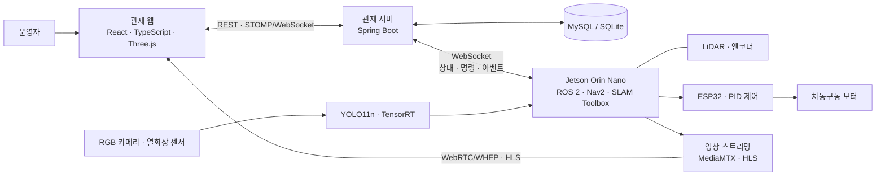

<p align="center">
  
</p>

<h1 align="center">삐용 · BBIYONG</h1>

<p align="center">
  <strong>공장의 야간 안전을 위한 자율주행 화재 감시 로봇</strong><br/>
  <sub>SSAFY 15기 공통 프로젝트 · 부울경 E101 · 6인 팀</sub>
</p>

<p align="center">
  
  
  
  
  
  
</p>
<p align="center">
  
  
  
  
  
</p>

<p align="center">
  <a href="#overview">프로젝트 소개</a>&nbsp;&nbsp;·&nbsp;&nbsp;
  <a href="#demo">화면과 시연</a>&nbsp;&nbsp;·&nbsp;&nbsp;
  <a href="#engineering">설계와 성과</a>&nbsp;&nbsp;·&nbsp;&nbsp;
  <a href="#architecture">기술 스택</a>&nbsp;&nbsp;·&nbsp;&nbsp;
  <a href="#team">팀 구성</a>
</p>

<a id="overview"></a>
## 프로젝트 한눈에 보기

**삐용은 로봇의 자율 순찰부터 화재 징후 감지, 웹 관제와 이벤트 기록까지 연결한 시스템입니다.** 사람이 상주하지 않는 공장에서 고정된 카메라만으로 확인하기 어려운 공간과 설비 주변을 살펴보기 위해 만들었습니다.

> **01 · 탐색과 순찰**<br/>
> LiDAR로 공간을 파악하고, 등록된 점검 지점과 아직 살펴보지 않은 구역을 순찰합니다.

> **02 · 화재 징후 확인**<br/>
> RGB 영상에서 불꽃과 연기를 탐지하고, 열화상 정보를 함께 확인합니다.

> **03 · 관제와 대응**<br/>
> 운영자는 웹에서 로봇의 위치·영상·경보를 보고 수동 제어와 이벤트 확인을 수행합니다.

### 핵심 결과

| 실제 장치 주행 | 관제 웹 연동 | AI 처리량 개선 |
| :--- | :--- | :--- |
| 실내 장애물 환경에서 이동 시연 | 지도·영상·제어·이벤트 이력 연결 | **33.37 → 70.60 FPS · 2.12배** |

AI 수치는 동일 장치·FP16 정밀도에서 측정한 영상 처리 파이프라인 기준입니다. 웹 영상의 재생 속도를 의미하지 않습니다. [측정 조건과 결과](AI/deployment/fire_smoke/README.md#verified-jetson-result-2026-08-03)

<a id="demo"></a>
## 실제로 움직이는 삐용

박스로 장애물을 구성한 실내 테스트 공간에서 실제 로봇이 이동합니다. 원본 촬영 영상의 01:00~01:20 구간이며 재생 속도는 그대로 유지했습니다.

<p align="center">
  <a href="docs/assets/readme/autonomous-driving.mp4">
    
  </a><br/>
  <sub>이미지를 누르면 20초 MP4 영상을 볼 수 있습니다 · 약 0.5 MB</sub>
</p>

## 로봇과 현장을 잇는 관제 화면

운영자는 생성된 지도를 확인하고, 화재 경보가 발생하면 이벤트 상세 화면에서 관련 기록과 영상을 살펴봅니다.

<table>
  <tr>
    <td width="50%" valign="top">
      
      <br/><strong>공간 확인</strong><br/>
      <sub>탐색으로 만든 지도를 3D로 확인하고 로봇의 위치를 파악합니다.</sub>
    </td>
    <td width="50%" valign="top">
      
      <br/><strong>이벤트 확인</strong><br/>
      <sub>화재 경보의 발생 정보와 연결된 현장 영상을 확인합니다.</sub>
    </td>
  </tr>
</table>

<sub>관제 화면과 아래 GIF는 팀 최종 발표 자료입니다. 지도와 이벤트 값은 발표 당시 데모 데이터입니다.</sub>

### 더 많은 기능과 시연

<details>
<summary><strong>지도 생성과 순찰</strong></summary>

#### 지도 생성과 관제

탐색으로 수집한 지도를 확인하고, 3D 뷰에서 공간 구조를 살펴봅니다.

| 지도 관리 | 3D 공간 확인 |
| :---: | :---: |
|  |  |


탐색 중 수집한 지도에서 벽과 이동 가능한 공간이 드러나는 과정입니다.


#### 미탐색 공간 탐색

Frontier 기반으로 알려진 공간과 미탐색 공간의 경계에서 다음 목표를 선택합니다. 지도 위의 로봇 이동과 탐색 영역 변화를 확인할 수 있습니다.

<p align="center">
  
</p>

#### 순찰 설정과 우선 구역 반복 순찰

관제 화면에서 순찰 공간과 지점을 확인합니다. 발표 자료에서는 설정한 우선 구역을 차례로 방문하는 순찰 경로와 반복 주행을 보여줍니다.


| 순찰 경로 구성 | 지도 위 경로 확인 |
| :---: | :---: |
|  |  |


</details>

<details>
<summary><strong>화재 인식과 열화상 확인</strong></summary>

#### AI 화재 인식과 관제 경보

화재 이벤트가 발생하면 관제 화면에 경보를 표시합니다. 아래 화면은 발표 PPT의 화재 경보 시연입니다.


YOLO11n으로 불꽃과 연기를 탐지합니다. 아래 GIF는 발표에서 사용한 영상 기반 탐지 예시입니다.

<p align="center">
  
</p>


불꽃을 보여주는 RGB 화면과 열화상 화면을 함께 확인하는 실험 장면입니다.


</details>

<details>
<summary><strong>이벤트 기록과 주행 복구</strong></summary>

#### 이벤트 이력과 상세 확인

발생한 이벤트를 목록에서 조회하고, 상세 화면에서 관련 기록과 영상을 확인합니다. 발표 자료의 이벤트 목록 개요와 후속 목록 상태를 함께 담았습니다.


| 이벤트 목록 | 이벤트 상세 |
| :---: | :---: |
|  |  |

#### 주행 복구 동작

발표 자료에서 설명한 막힌 경로의 복구 동작입니다. 로봇이 회전·후진한 뒤 탐색을 재개하는 모습을 3D 지도에서 보여줍니다.

<p align="center">
  
</p>

</details>

<a id="team"></a>
## 팀 구성

관제 웹, 서버, 로봇·AI, 인프라를 나누어 개발한 6인 팀 프로젝트입니다.

| 이름 | 담당 |
| --- | --- |
| 모진성 | 팀장 · Backend |
| 장효준 | Hardware · AI |
| 고지혁 | Hardware · AI |
| 박재현 | CI/CD · Infra |
| 이승현 | Frontend · VP |
| 이예승 | Frontend · IP |

---

<a id="engineering"></a>
## 설계와 기술적 성과

| 구현 과제 | 적용한 방법 | 확인할 수 있는 결과 |
| --- | --- | --- |
| 로봇 안에서 빠르게 화재 영상을 분석하기 | 학습 모델을 ONNX로 변환하고 TensorRT FP16으로 실행 | 동일 FP16 기준 파이프라인 처리량 약 2.12배 |
| 지도를 만들고 점검 지점까지 이동하기 | 지도 생성·위치 추정·경로 주행을 ROS 2와 Nav2로 연결 | 지도 기반 탐색과 점검 지점 순찰 |
| 영상과 탐지 정보를 함께 보여주기 | 영상 전송과 상태·제어 통신을 분리하고 시간 보정 설정 적용 | 영상과 탐지 결과의 도착 시간 차이를 처리하는 구조 |

<details>
<summary><strong>성능 수치와 구현 과정 보기</strong> — 측정 조건·주행 구조·영상 처리</summary>

### Jetson에서의 AI 추론 최적화

학습한 YOLO11n 모델을 ONNX로 내보내고 Jetson에서 TensorRT 엔진으로 변환했습니다. 동일한 FP16 정밀도로 비교했을 때 **전체 파이프라인 처리량이 33.37 FPS에서 70.60 FPS로 약 2.12배 증가**했습니다.

| 실행 방식 | 모델 추론 평균 | 전체 파이프라인 평균 | 처리량 |
| --- | ---: | ---: | ---: |
| PyTorch FP32 | 30.165 ms | 35.287 ms | 28.34 FPS |
| PyTorch FP16 | 24.744 ms | 29.970 ms | 33.37 FPS |
| TensorRT FP16 | **10.510 ms** | **14.170 ms** | **70.60 FPS** |

측정 기준: 2026-08-03, Jetson Orin, CUDA 12.6, TensorRT 10.3.0, 입력 640×640, batch 1. 같은 JPEG 40장을 5회 반복한 200프레임 기준입니다. 이 값은 **AI 추론 파이프라인 성능**이며 웹 영상의 송출 FPS나 전체 관제 지연을 의미하지 않습니다. [벤치마크 기록과 재현 방법](AI/deployment/fire_smoke/README.md#verified-jetson-result-2026-08-03)

### 지도·위치 추정·주행의 연결

SLAM Toolbox로 지도를 만들고, 저장된 지도에서 AMCL로 위치를 추정합니다. Frontier 탐색과 점검 지점 순찰을 Nav2 이동 목표로 연결합니다. 실제 구동부는 ESP32의 엔코더 피드백·PID 제어를 사용하는 차동구동 구조입니다.

- [Frontier 탐색 구현](BE_robot/ros2_ws/src/bbiyong_explorer/README.md)
- [점검 지점 관리와 순찰](BE_robot/ros2_ws/src/bbiyong_inspection/README.md)
- [모터·센서 배선 및 구동 구조](BE_robot/README.md)

### 영상과 제어 데이터의 분리

브라우저는 STOMP/WebSocket으로 상태를 구독하고 명령을 보냅니다. 전면 영상은 WebRTC/WHEP 경로와 HLS 재생 경로를 사용합니다. 영상과 탐지 결과가 서로 다른 시점에 도착하는 문제를 고려해 프런트엔드에 시간 보정 설정을 둡니다. [통신·영상 설정](FE/bbiyong-react/src/live/config.ts)

</details>

<a id="architecture"></a>
## 시스템 구성과 기술 스택

로봇이 현장 정보를 수집하면 서버가 이를 기록하고 관제 웹에 전달합니다. 운영자는 웹에서 상황을 확인하고 로봇에 명령을 보냅니다.

<details>
<summary><strong>시스템 연결 구조 보기</strong> — 웹·서버·로봇이 정보를 주고받는 방식</summary>



</details>

### 기술 스택

**화면 · 서버와 DB · 영상 · AI · 로봇 · 인프라**가 함께 동작합니다. 궁금한 분야를 클릭하면 사용 기술과 역할을 볼 수 있습니다.

<details>
<summary><strong>관제 화면</strong> — 사람이 보고 조작하는 웹</summary>

| 영역 | 기술 | 사용 목적 |
| --- | --- | --- |
| 웹 UI | **React 18 · TypeScript 5 · HTML · CSS** | 관제 화면, 상태 표시, 사용자 입력 처리 |
| 웹 빌드 | **Vite 5 · Node.js · npm** | 개발 서버, 의존성 관리, 정적 리소스 빌드 |
| 지도 시각화 | **Three.js · Canvas** | 3D 지도와 로봇 위치·이동 경로 표현 |

</details>

<details>
<summary><strong>서버와 데이터베이스</strong> — 사용자·로봇·이벤트 기록 관리</summary>

| 영역 | 기술 | 사용 목적 |
| --- | --- | --- |
| 관제 API | **Java 17 · Spring Boot 4.1 · Spring MVC** | 로봇·지도·이벤트·사용자 관리 REST API |
| 인증·인가 | **Spring Security · JWT (JJWT) · BCrypt** | 토큰 인증, 권한 검사, 비밀번호 해시 |
| 데이터 접근 | **Spring Data JPA · Hibernate · HikariCP · JDBC** | 엔티티 영속화, DB 연결과 커넥션 풀 관리 |
| 운영 DB | **MySQL 8.0 · MySQL Connector/J** | Docker Compose 배포 환경의 관계형 데이터 저장 |
| 로컬 DB | **SQLite · SQLite JDBC** | 별도 DB 서버 없이 로컬 실행·테스트 |
| 파일 저장 | **로컬 파일시스템 · Docker Bind Mount** | 지도·이벤트 영상 파일 보관과 컨테이너 재생성 시 데이터 유지 |
| 서버 이미지 처리 | **OpenCV · JavaCPP · OpenBLAS** | 지도 이미지 정제와 네이티브 영상 처리 연동 |
| 알림 | **Spring Mail · SMTP · Mattermost Webhook** | 이메일 인증과 이벤트 알림 |
| API 문서·운영 진단 | **SpringDoc OpenAPI · Swagger UI · Actuator · Logback** | API 문서화, 상태 확인, JSON 로그 출력 |

운영 환경은 **MySQL 8.0**, 로컬 개발 환경은 **SQLite**를 사용합니다. 지도와 영상 파일은 별도 폴더에 저장해 컨테이너를 다시 만들어도 보존합니다.

</details>

<details>
<summary><strong>실시간 통신과 영상</strong> — 현장 상황을 화면으로 전달</summary>

| 영역 | 기술 | 사용 목적 |
| --- | --- | --- |
| 실시간 통신 | **WebSocket/WSS · STOMP · @stomp/stompjs** | 로봇 상태·경보 구독과 제어 명령 전달 |
| 영상 전달·재생 | **MediaMTX · WebRTC/WHEP · HLS · hls.js** | 실시간 카메라 영상 전달과 브라우저 재생 |
| 영상 처리 | **GStreamer · H.264/x264 · FFmpeg** | 로봇 영상 인코딩, HLS 처리, 이벤트 클립 생성 |

</details>

<details>
<summary><strong>AI와 자율주행</strong> — 화재를 감지하고 길을 찾는 기술</summary>

| 영역 | 기술 | 사용 목적 |
| --- | --- | --- |
| AI 학습 | **Python · PyTorch · Ultralytics · YOLO11n** | 불꽃·연기 탐지 모델 학습과 평가 |
| AI 추론 배포 | **ONNX · TensorRT 10.3 · CUDA 12.6 · JetPack** | Jetson GPU 추론과 FP16 최적화 |
| 로봇 미들웨어 | **ROS 2 Humble · rclpy · TF2** | 노드 간 통신, 좌표 변환, 센서·제어 연결 |
| 지도·위치 추정 | **SLAM Toolbox · AMCL · RF2O** | 지도 작성, 저장 지도 기반 위치 추정, LiDAR 오도메트리 구성 |
| 경로 계획·순찰 | **Nav2 · Frontier Exploration · AprilTag · OpenCV · NumPy** | 이동 목표 실행, 미탐색 영역 선택, 점검 지점 인식·계산 |

</details>

<details>
<summary><strong>로봇 하드웨어</strong> — 보고 움직이는 실제 장치</summary>

| 영역 | 기술 | 사용 목적 |
| --- | --- | --- |
| 로봇 연산·센서 | **Jetson Orin Nano · YDLIDAR X4 Pro · RGB 카메라 · MLX90640** | 온디바이스 연산, 거리·영상·열화상 수집 |
| 구동·펌웨어 | **ESP32 · MDD10A · 엔코더 · PID · PWM · USB Serial** | 차동구동 모터 속도 제어와 피드백 |

</details>

<details>
<summary><strong>인프라와 개발 도구</strong> — 서비스 배포·운영·품질 관리</summary>

| 영역 | 기술 | 사용 목적 |
| --- | --- | --- |
| 클라우드 | **AWS EC2** | 관제 백엔드와 영상 중계 서버 운영 |
| 컨테이너·웹 서버 | **Docker · Docker Compose · Nginx** | 서비스 패키징, DB·앱 실행, 정적 웹 배포 |
| CI/CD·빌드 | **Jenkins · Gradle Wrapper · Git** | 파트별 빌드·검증·배포와 버전 관리 |
| 테스트·검증 | **JUnit Platform · Spring Boot Test · Mockito · Python unittest · pytest · TypeScript tsc** | 서버·로봇·AI 테스트와 웹 타입 검사 |
| 협업·산출물 관리 | **GitHub · GitLab · Git LFS · Jira** | 코드 리뷰, 대용량 파일 관리, 작업 추적 |

</details>

<details>
<summary><strong>기술 스택 확인 근거</strong> — 의존성과 설정 파일</summary>

버전은 저장소 설정 기준이며, CUDA·TensorRT는 기록된 Jetson 벤치마크 환경 기준입니다.

- [웹 의존성](FE/bbiyong-react/package.json) · [웹 통신·영상 설정](FE/bbiyong-react/src/live/config.ts)
- [서버 의존성](BE_system/build.gradle) · [운영 DB·파일 저장 설정](BE_system/compose.yaml) · [로컬 DB 기본 설정](BE_system/src/main/resources/application.properties)
- [AI 의존성](AI/requirements.txt) · [Jetson 추론 환경](AI/deployment/fire_smoke/README.md)
- [ROS 2 패키지 구성](BE_robot/ros2_ws/src/bbiyong_bringup/package.xml) · [로봇 영상 파이프라인](BE_robot/orin_dashboard/README.md) · [하드웨어 구성](BE_robot/README.md)

</details>

<a id="getting-started"></a>
## 실행 안내

개발 환경에서 직접 실행하려면 아래 안내를 펼쳐보세요. 전체 기능을 사용하려면 관제 서버와 로봇 장치가 필요합니다.

<details>
<summary><strong>관제 웹 실행 — 개발 서버와 연결 설정</strong></summary>

Node.js와 npm을 설치한 뒤 실행합니다.

```bash
cd FE/bbiyong-react
npm ci
npm run dev
```

개발 서버는 기본적으로 `http://localhost:5173`에서 열립니다. 로컬 백엔드와 연결하려면 `FE/bbiyong-react/.env.local`에 다음을 지정합니다.

```dotenv
VITE_REST_BASE_URL=http://localhost:8080
VITE_WS_URL=ws://localhost:8080/ws/control
```

영상은 별도의 스트리밍 서버 설정이 필요합니다. `VITE_HLS_URL`, `VITE_WHEP_PATH` 등은 [설정 코드](FE/bbiyong-react/src/live/config.ts)를 참고하세요. 환경변수를 생략하면 코드에 지정된 기존 배포 서버 주소를 사용합니다.

</details>

<details>
<summary><strong>관제 서버 실행 — Java와 데이터베이스 설정</strong></summary>

Java 17과 저장소의 Gradle Wrapper를 사용합니다. 다음 환경변수를 설정한 뒤 `BE_system`에서 실행합니다.

| 환경변수 | 설명 |
| --- | --- |
| `BBIYONG_JWT_SECRET` | JWT 서명 키. 32바이트 이상 필수 |
| `BBIYONG_ROBOT_UPLOAD_TOKEN` | 로봇 연결·업로드 인증 토큰. 필수 |
| `SPRING_DATASOURCE_URL` | 생략하면 로컬 SQLite 사용. 외부 DB 사용 시 드라이버·방언도 함께 설정 |

```bash
cd BE_system
./gradlew bootRun
```

Windows PowerShell에서는 `./gradlew.bat bootRun`을 사용합니다. 추가 환경변수는 [서버 설정](BE_system/src/main/resources/application.properties)을 참고하세요.

</details>

<details>
<summary><strong>로봇·AI 실행 — 장치 설정과 모델 준비</strong></summary>

- **로봇 실행 환경**: [ROS 2 워크스페이스](BE_robot/ros2_ws/README.md), [로봇 실행 도구](BE_robot/tools/README.md)
- **모델 학습**: [AI 학습 가이드](AI/README.md)
- **Jetson 배포**: [ONNX 변환·TensorRT 빌드·벤치마크](AI/deployment/fire_smoke/README.md)

학습 데이터와 모델 바이너리는 별도로 준비해야 합니다. 하위 문서에는 초기 차량 설계 기록도 포함되어 있으므로 실제 하드웨어 구성은 [현재 배선 문서](BE_robot/README.md)의 차동구동 구성을 기준으로 확인하세요.

</details>

## 저장소 구조

<details>
<summary><strong>폴더별 역할 보기</strong></summary>

```text
.
├── FE/bbiyong-react/    # React 관제 웹
├── BE_system/          # Spring Boot 관제 서버
├── BE_robot/           # 로봇 펌웨어·도구·ROS 2 패키지
├── AI/                 # 모델 학습·평가·Jetson 배포
├── docs/               # 설계·API·발표 자료
│   └── assets/readme/  # 발표 PPT에서 추출한 README 이미지·GIF
└── Jenkinsfile.*       # 파트별 CI/CD
```

</details>

## 더 알아보기

- [시스템 아키텍처와 통신 명세](docs/architecture_and_api_spec.md)
- [백엔드 API 명세](docs/backend_api_specification.md)
- [프런트엔드·백엔드 연동 가이드](docs/fe_backend_integration_guide.md)
- [시각 자료 출처](docs/assets/readme/README.md)


<details>
<summary><strong>로봇 디자인 콘셉트</strong></summary>


발표 자료의 디자인 콘셉트 이미지입니다. 실제 장치의 주행 모습은 문서 상단 시연에서 확인할 수 있습니다.

</details>
