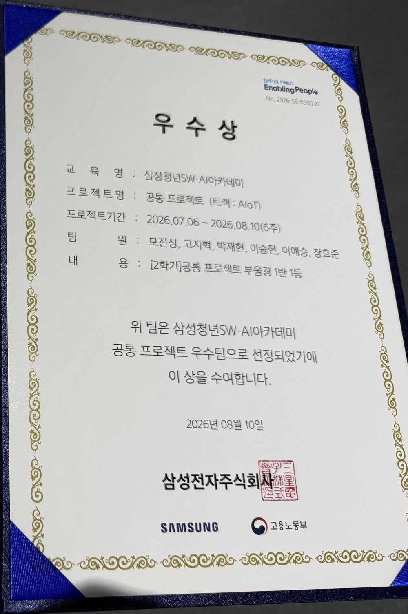
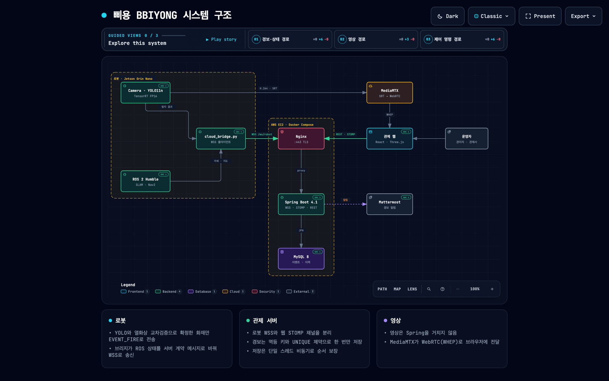
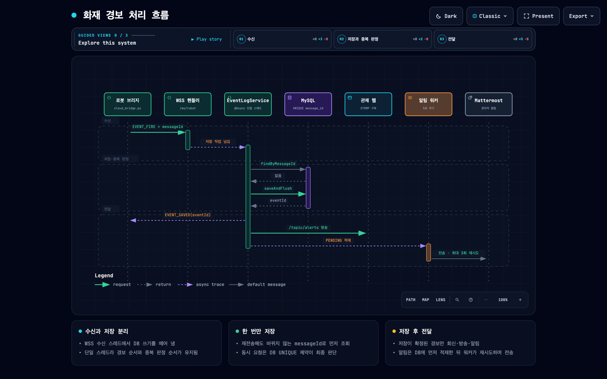
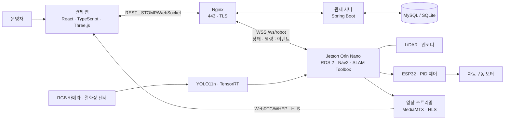

<p align="center">
  
</p>

<h1 align="center">삐용 · BBIYONG</h1>

<p align="center">
  <strong>공장의 야간 안전을 위한 자율주행 화재 감시 로봇</strong><br/>
  <sub>SSAFY 15기 공통 프로젝트 · 부울경 E101 · 6인 팀 · 2026.07.06 ~ 2026.08.10 (6주)</sub><br/>
  <sub>공통 프로젝트 우수상 · 부울경 1반 1등</sub>
</p>

<p align="center">
  
  
  
  
  
  
</p>
<p align="center">
  
  
  
  
  
</p>

<p align="center">
  <a href="#overview">프로젝트 소개</a>&nbsp;&nbsp;·&nbsp;&nbsp;
  <a href="#demo">화면과 시연</a>&nbsp;&nbsp;·&nbsp;&nbsp;
  <a href="#engineering">설계와 성과</a>&nbsp;&nbsp;·&nbsp;&nbsp;
  <a href="#architecture">기술 스택</a>&nbsp;&nbsp;·&nbsp;&nbsp;
  <a href="#team">팀 구성</a>&nbsp;&nbsp;·&nbsp;&nbsp;
  <a href="#my-role">내가 맡은 일</a>
</p>

<a id="overview"></a>
## 프로젝트 한눈에 보기

**삐용은 로봇의 자율 순찰부터 화재 징후 감지, 웹 관제와 이벤트 기록까지 연결한 시스템입니다.** 사람이 상주하지 않는 공장에서 고정된 카메라만으로 확인하기 어려운 공간과 설비 주변을 살펴보기 위해 만들었습니다.

### 왜 만들었나

프로젝트를 시작하면서 가장 먼저 본 문제는 **사람이 없는 시간에 경보가 울려도 현장 상황을 바로 확인하기 어렵다는 점**이었습니다. 야간에는 상주 인력이 적고, 고정형 CCTV는 카메라가 향한 곳만 볼 수 있습니다. 연기나 빛 반사처럼 화재와 비슷한 장면 때문에 경보가 발생하면 실제 화재인지 판단하기도 어렵습니다.

카메라를 더 설치하는 대신, 카메라와 열화상 센서를 싣고 직접 이동하는 로봇을 만들기로 했습니다. 평소에는 설비 주변과 미탐색 구역을 순찰하고, 화재 징후를 발견하면 가까이 이동해 RGB 영상과 열화상을 함께 확인합니다. 확인한 결과와 현장 영상은 관제 웹으로 보내 운영자가 한 화면에서 상황을 판단할 수 있도록 구성했습니다.

기획할 때 정한 기준은 단순했습니다. **사람이 없는 시간에도 현장을 돌아다니며 직접 확인할 수 있어야 한다.** 이 기준을 중심으로 자율주행, 화재 감지, 관제 기능을 하나의 흐름으로 연결했습니다.

### 주요 기능

- **탐색과 순찰** - LiDAR로 지도를 만들고 점검 지점과 미탐색 구역을 순찰합니다.
- **화재 감지** - RGB 영상에서 불꽃과 연기를 찾고 열화상으로 한 번 더 확인합니다.
- **관제와 대응** - 웹에서 로봇 위치, 영상, 경보를 확인하고 필요하면 직접 조종합니다.

### 핵심 결과

| 실제 장치 주행 | 관제 웹 연동 | AI 처리량 개선 |
| :--- | :--- | :--- |
| 실내 장애물 환경에서 이동 시연 | 지도·영상·제어·이벤트 이력 연결 | **33.37 → 70.60 FPS · 2.12배** |

성능 수치는 같은 장치와 FP16 조건에서 측정한 AI 파이프라인 결과입니다. [측정 조건](AI/deployment/fire_smoke/README.md#verified-jetson-result-2026-08-03)

### 수상

삼성청년SW·AI아카데미 2학기 공통 프로젝트(AIoT 트랙)에서 우수상을 받았습니다. 부울경 1반 1등입니다.

<p align="center">
  
</p>

<a id="demo"></a>
## 실제로 움직이는 삐용

박스로 장애물을 구성한 실내 테스트 공간에서 실제 로봇이 이동합니다. 원본 촬영 영상의 01:00~01:20 구간이며 재생 속도는 그대로 유지했습니다.

<p align="center">
  <a href="docs/assets/readme/autonomous-driving.mp4">
    
  </a><br/>
  <sub>이미지를 누르면 20초 MP4 영상을 볼 수 있습니다 · 약 0.5 MB</sub>
</p>

## 관제 화면

생성된 지도에서 로봇 위치를 확인하고, 화재 경보가 발생하면 관련 기록과 영상을 조회할 수 있습니다.

<table>
  <tr>
    <td width="50%" valign="top">
      
      <br/><strong>공간 확인</strong><br/>
      <sub>탐색으로 만든 지도를 3D로 확인하고 로봇의 위치를 파악합니다.</sub>
    </td>
    <td width="50%" valign="top">
      
      <br/><strong>이벤트 확인</strong><br/>
      <sub>화재 경보의 발생 정보와 연결된 현장 영상을 확인합니다.</sub>
    </td>
  </tr>
</table>

<sub>관제 화면과 GIF는 최종 발표 자료를 사용했습니다. 화면의 지도와 이벤트 값은 발표 당시 데모 데이터입니다.</sub>

### 더 많은 기능과 시연

<details>
<summary><strong>지도 생성과 순찰</strong></summary>

#### 지도 생성과 관제

탐색으로 수집한 지도를 확인하고, 3D 뷰에서 공간 구조를 살펴봅니다.

| 지도 관리 | 3D 공간 확인 |
| :---: | :---: |
|  |  |


탐색 중 수집한 지도에서 벽과 이동 가능한 공간이 드러나는 과정입니다.


#### 미탐색 공간 탐색

Frontier 기반으로 알려진 공간과 미탐색 공간의 경계에서 다음 목표를 선택합니다. 지도 위의 로봇 이동과 탐색 영역 변화를 확인할 수 있습니다.

<p align="center">
  
</p>

#### 순찰 설정과 우선 구역 반복 순찰

관제 화면에서 순찰 공간과 지점을 확인합니다. 발표 자료에서는 설정한 우선 구역을 차례로 방문하는 순찰 경로와 반복 주행을 보여줍니다.


| 순찰 경로 구성 | 지도 위 경로 확인 |
| :---: | :---: |
|  |  |


</details>

<details>
<summary><strong>화재 인식과 열화상 확인</strong></summary>

#### AI 화재 인식과 관제 경보

화재 이벤트가 발생하면 관제 화면에 경보를 표시합니다. 아래 화면은 발표 PPT의 화재 경보 시연입니다.


YOLO11n으로 불꽃과 연기를 탐지합니다. 아래 GIF는 발표에서 사용한 영상 기반 탐지 예시입니다.

<p align="center">
  
</p>


불꽃을 보여주는 RGB 화면과 열화상 화면을 함께 확인하는 실험 장면입니다.


</details>

<details>
<summary><strong>이벤트 기록과 주행 복구</strong></summary>

#### 이벤트 이력과 상세 확인

발생한 이벤트를 목록에서 조회하고 상세 화면에서 기록과 영상을 확인합니다.


| 이벤트 목록 | 이벤트 상세 |
| :---: | :---: |
|  |  |

#### 주행 복구 동작

발표 자료에서 설명한 막힌 경로의 복구 동작입니다. 로봇이 회전·후진한 뒤 탐색을 재개하는 모습을 3D 지도에서 보여줍니다.

<p align="center">
  
</p>

</details>

<a id="team"></a>
## 팀 구성

관제 웹, 서버, 로봇·AI, 인프라를 나누어 개발했습니다.

| 이름 | 담당 |
| --- | --- |
| 모진성 | 팀장 · Backend |
| 장효준 | Hardware · AI |
| 고지혁 | Hardware · AI |
| 박재현 | CI/CD · Infra |
| 이승현 | Frontend · VP |
| 이예승 | Frontend · IP |

<a id="my-role"></a>
## 내가 맡은 일 · 모진성 (팀장 · Backend)

팀장을 맡으면서 관제 서버를 만들었습니다. 로봇이 보낸 상태와 경보를 받아 기록하고, 관제 웹에 전달하고, 운영자의 명령을 다시 로봇에 보내는 서버입니다. 팀이 같은 규칙으로 일할 수 있도록 브랜치 전략과 Jira 운영 방식도 정했습니다.

| 항목 | 내용 |
| --- | --- |
| 관제 백엔드 | 관제 서버 주 개발. 관제 백엔드 에픽 이슈 132건 중 94건 담당 |
| 테스트 | 담당 기능의 테스트 작성. 서버 테스트 약 210건이 MR마다 CI에서 실행 |
| 통합 | 파트별 dev → main 승격과 최종 릴리스 통합 담당 |

<sub>이슈 수는 팀이 사용한 Jira 기준입니다. 이 저장소는 결과물을 옮겨 온 사본이라 커밋 이력이 하나로 합쳐져 있습니다.</sub>

**주요 작업**

- **로봇·서버·웹 실시간 통신**: 로봇 전용 WebSocket(`/ws/robot`)과 관제 웹용 STOMP 채널을 나눠 설계했습니다. 처음에는 TCP 9000번 포트로 구현했는데 서버 방화벽이 9000번을 막고 443 같은 표준 포트만 열어 두고 있었습니다. 그래서 Nginx를 거치는 WSS(443)로 바꿨고, 메시지 형식은 그대로 두고 전송 방식만 바꿔 다른 파트가 고칠 범위를 줄였습니다.
- **경보 저장과 실시간 수신 분리**: 경보 저장을 단일 스레드 비동기 처리로 옮겨 순서를 지키면서도 실시간 수신은 멈추지 않습니다. 재접속 순서 문제, 중복 판정용 맵이 계속 커지던 문제 등 점검에서 찾은 결함 8건도 함께 고쳤습니다.
- **인증과 보안**: 관리자는 JWT로, 로봇은 연결 시 토큰으로 인증합니다. 서명 키가 없거나 32바이트보다 짧으면 서버가 아예 뜨지 않으므로 기본값으로 운영되는 일을 막았습니다.
- **관제 기능 API**: 이벤트 이력과 상태 처리, 통계, 순찰 경로, 설비 임계 온도, 로봇 상태 이력을 구현했습니다. 로봇이 만든 저해상도 SLAM 지도(예: 73×59)는 OpenCV로 보정해 관리자가 읽을 수 있는 도면으로 바꿉니다.
- **로봇 연동 브리지**: 서버를 배포하고 보니 텔레메트리가 한 건도 들어오지 않았습니다. 확인해 보니 로봇에 서버와 연결하는 코드가 없었습니다. 로봇 쪽 WebSocket 브리지(`cloud_bridge.py`)를 직접 작성해 로봇, 서버, 웹을 처음으로 끝까지 연결했습니다.
- **협업 체계**: 4단계 브랜치 전략과 Jira 3계층 이슈 체계를 정했고 팀원마다 다른 AI 도구가 같은 규칙을 따르도록 규칙 파일도 작성했습니다.

---

<a id="engineering"></a>
## 설계와 기술적 성과

| 구현 과제 | 적용한 방법 | 결과 |
| --- | --- | --- |
| 로봇 안에서 빠르게 화재 영상을 분석하기 | 학습 모델을 ONNX로 변환하고 TensorRT FP16으로 실행 | 동일 FP16 기준 파이프라인 처리량 약 2.12배 |
| 지도를 만들고 점검 지점까지 이동하기 | 지도 생성·위치 추정·경로 주행을 ROS 2와 Nav2로 연결 | 지도 기반 탐색과 점검 지점 순찰 |
| 영상과 탐지 정보를 함께 보여주기 | 영상 전송과 상태·제어 통신을 분리하고 시간 보정 설정 적용 | 영상과 탐지 결과의 도착 시간 차이를 처리하는 구조 |
| 방화벽 안에서 로봇과 서버 연결하기 | TCP 9000번 대신 Nginx를 거치는 WSS(443), 로봇용 채널과 웹용 STOMP 채널 분리 | 방화벽 설정을 바꾸지 않고 연결, 메시지 형식은 그대로 유지 |
| 같은 경보를 한 번만 기록하기 | 멱등 키와 DB 유니크 제약, 단일 스레드 비동기 저장 | 재전송·동시 요청에도 한 건만 저장, 저장 중에도 실시간 수신 유지 |

<details>
<summary><strong>성능 수치와 구현 과정</strong> - 측정 조건, 주행 구조, 영상 처리</summary>

### Jetson에서의 AI 추론 최적화

학습한 YOLO11n 모델을 ONNX로 내보내고 Jetson에서 TensorRT 엔진으로 변환했습니다. 동일한 FP16 정밀도로 비교했을 때 **전체 파이프라인 처리량이 33.37 FPS에서 70.60 FPS로 약 2.12배 증가**했습니다.

| 실행 방식 | 모델 추론 평균 | 전체 파이프라인 평균 | 처리량 |
| --- | ---: | ---: | ---: |
| PyTorch FP32 | 30.165 ms | 35.287 ms | 28.34 FPS |
| PyTorch FP16 | 24.744 ms | 29.970 ms | 33.37 FPS |
| TensorRT FP16 | **10.510 ms** | **14.170 ms** | **70.60 FPS** |

측정 환경은 Jetson Orin, CUDA 12.6, TensorRT 10.3.0이며 입력 크기는 640×640, batch는 1입니다. JPEG 40장을 5회 반복해 총 200프레임을 측정했습니다. 표의 FPS는 AI 추론 파이프라인 성능입니다. [벤치마크 재현 방법](AI/deployment/fire_smoke/README.md#verified-jetson-result-2026-08-03)

### 지도·위치 추정·주행의 연결

SLAM Toolbox로 지도를 만들고, 저장된 지도에서 AMCL로 위치를 추정합니다. Frontier 탐색과 점검 지점 순찰을 Nav2 이동 목표로 연결합니다. 실제 구동부는 ESP32의 엔코더 피드백·PID 제어를 사용하는 차동구동 구조입니다.

- [Frontier 탐색 구현](BE_robot/ros2_ws/src/bbiyong_explorer/README.md)
- [점검 지점 관리와 순찰](BE_robot/ros2_ws/src/bbiyong_inspection/README.md)
- [모터·센서 배선 및 구동 구조](BE_robot/README.md)

### 영상과 제어 데이터의 분리

브라우저는 STOMP/WebSocket으로 상태를 구독하고 명령을 보냅니다. 전면 영상은 WebRTC/WHEP 경로와 HLS 재생 경로를 사용합니다. 영상과 탐지 결과가 서로 다른 시점에 도착하는 문제를 고려해 프런트엔드에 시간 보정 설정을 둡니다. [통신·영상 설정](FE/bbiyong-react/src/live/config.ts)

</details>

<a id="backend-troubleshooting"></a>
## 백엔드에서 풀었던 문제들

<details>
<summary><strong>영상 프레임이 들어오면 로봇 연결이 끊기던 문제</strong> - 1009 message too big</summary>

로봇 영상 프레임(base64 JPEG, 약 30~40KB)이 Tomcat WebSocket 기본 버퍼 8KB를 넘으면서 연결이 계속 끊겼습니다. 버퍼를 512KB로 올렸는데 이번에는 이 설정이 테스트 환경에서 예외를 던져 테스트 17개가 실패하고 자동 배포가 멈췄습니다. 설정 방식을 실제 내장 Tomcat이 만들어질 때만 적용되도록 바꿔 2시간 18분 만에 CI를 되살렸습니다.

이후 H.264 키프레임에서 같은 문제가 다시 났습니다. 프로토콜은 2MB까지 허용하는데 서버 버퍼는 512KB였기 때문입니다. 이번에는 두 값이 다시 어긋나지 않도록 숫자를 직접 적는 대신 프로토콜 상수(payload 2MB + 헤더 40B + robot_id 128B)에서 버퍼 크기를 계산하게 바꿨습니다.

[WebSocketConfig.java](BE_system/src/main/java/com/bbiyong/server/wss/WebSocketConfig.java)

</details>

<details>
<summary><strong>살아 있는 로봇이 오프라인으로 보이던 문제</strong> - 재접속 순서 문제</summary>

로봇이 다시 접속한 직후 옛 연결의 종료 처리가 늦게 도착하면 새 연결 정보까지 지워지고 있었습니다. 로봇은 정상인데 관제 화면에는 오프라인으로 뜨고 명령도 전달되지 않았습니다. 새 연결을 등록할 때 옛 연결 정보를 먼저 지우고 옛 연결을 직접 닫도록 순서를 바꿨습니다.

반대로 연결이 조용히 끊긴 경우도 있었습니다. 서버가 켜질 때 넣어 두던 가짜 상태를 없애고 텔레메트리가 15초 동안 없으면 오프라인으로 전환합니다. 5초마다 점검하므로 늦어도 20초 안에 화면에 반영됩니다.

[RobotWebSocketSessionManager.java](BE_system/src/main/java/com/bbiyong/server/wss/RobotWebSocketSessionManager.java)

</details>

<details>
<summary><strong>경보 저장이 실시간 수신을 막던 문제</strong> - 순서를 지키는 비동기 처리</summary>

경보를 DB에 저장하는 작업이 WebSocket 수신 스레드에서 바로 실행되고 있었습니다. 저장이 늦어지면 텔레메트리와 영상 수신까지 함께 밀리는 구조였습니다. 경보가 들어온 순서와 중복 판정 순서가 바뀌면 안 되므로 저장 작업을 비동기로 옮기되 스레드는 하나만 두었습니다. 대기열(200건)이 차면 호출한 쪽이 직접 처리하므로 경보를 버리지 않고 속도만 늦춥니다.

같은 점검에서 심각도 높은 결함 3건과 중간 5건을 찾아 함께 고쳤습니다. 경보 좌표가 (0, 0)으로 고정돼 있던 문제, 공개된 기본 시크릿, 중복 판정용 맵이 계속 커지던 문제, 잘못된 영상 범위 요청에 500을 돌려주던 문제 등입니다.

[EventLogService.java](BE_system/src/main/java/com/bbiyong/server/event/service/EventLogService.java) · [AsyncConfig.java](BE_system/src/main/java/com/bbiyong/server/common/config/AsyncConfig.java)

</details>

<details>
<summary><strong>같은 경보가 두 번 저장될 수 있던 문제</strong> - 멱등 키와 유니크 제약</summary>

무선 환경이라 로봇이 같은 경보를 다시 보내는 일이 생깁니다. 경보마다 재전송해도 바뀌지 않는 `messageId`를 붙이고 서버는 먼저 조회해서 이미 있으면 무시합니다. 조회와 저장 사이에 같은 요청이 동시에 들어오는 경우는 DB 유니크 제약으로 막고, 제약 위반은 "이미 처리된 요청"으로 보고 넘깁니다. 메모리에만 기록하면 서버를 다시 켤 때 사라지기 때문에 최종 판단은 DB에 맡겼습니다.

이 방식은 DB가 UNIQUE 제약을 실제로 지켜야 동작합니다. 초기 DB였던 SQLite에서는 그렇지 않았고, 이것이 MySQL로 옮긴 이유 중 하나입니다(바로 아래 항목).

</details>

<details>
<summary><strong>SQLite 잠금을 커넥션 1개로 피하다 생긴 대기</strong> - MySQL 전환</summary>

처음 서버는 라즈베리파이 5에 올릴 계획이었습니다. 작은 장비에서 DB 서버를 따로 띄우지 않아도 되고, 팀원 여섯 명이 설치 없이 바로 실행할 수 있어서 SQLite로 시작했습니다. 당시 DB에 넣을 데이터는 경보 이력 정도였고, 자주 바뀌는 로봇 상태는 메모리에 두었으니 쓰기가 많지 않을 거라고 봤습니다.

SQLite는 쓰기 잠금을 DB 파일 전체에 겁니다. 여러 커넥션이 동시에 쓰면 `database is locked` 오류가 나기 때문에 처음부터 커넥션 풀을 1로 묶어 두었습니다. 잠금 오류는 사라졌지만 모든 조회와 쓰기가 커넥션 하나를 기다리게 됐습니다. 경보 저장이 WebSocket 수신 스레드에서 실행되던 구조와 겹쳐, 저장이 밀리면 텔레메트리와 영상 수신까지 같이 멈출 수 있었습니다. 오류를 없앤 대신 대기가 애플리케이션 스레드로 옮겨 온 셈입니다.

문제는 이것만이 아니었습니다. SQLite용 Hibernate 방언이 FK·UNIQUE·Index를 오류 없이 무시했고, 일부 엔티티에서는 자동 증가 ID가 깨져 엔티티 4개를 UUID 기본키로 우회해야 했습니다. 서버를 EC2로 옮기면서 메모리 여유(15GB 중 13GB)도 생겨 팀에서 MySQL 8로 옮기기로 했습니다.

저는 전환 마무리를 맡았습니다. SQLite 때문에 1로 고정돼 MySQL에도 그대로 적용되던 커넥션 풀을 환경변수로 바꿔 운영에서는 10으로 늘렸습니다. MySQL healthcheck를 붙여 DB가 준비되기 전에는 서버가 뜨지 않게 했습니다. 로컬과 테스트는 SQLite를 그대로 쓸 수 있게 두었고, 전체 전환은 기능 개발과 함께 4일 걸렸습니다. 개발 환경에서는 여전히 커넥션이 하나이므로, 이후 경보 저장을 수신 스레드에서 떼어 내 같은 막힘이 다시 생기지 않게 했습니다.

남은 과제도 있습니다. UUID 문자열 기본키는 MySQL 인덱스에서 삽입 비용이 커서 순차 ID로 되돌리는 편이 낫고, 스키마 변경 이력을 남기려면 `ddl-auto` 대신 마이그레이션 도구가 필요합니다.

[application.properties](BE_system/src/main/resources/application.properties) · [compose.yaml](BE_system/compose.yaml)

</details>

<details>
<summary><strong>원격 조종이 어려웠던 영상 지연</strong> - STOMP 중계에서 WebRTC로</summary>

처음에는 서버가 영상 프레임을 받아 STOMP로 관제 화면마다 복사해 보냈습니다. 보는 사람이 늘수록 서버 송신량이 그만큼 늘었고, 느린 브라우저 하나가 버퍼를 채우면 연결이 끊겼습니다. 끊김은 3시간에 20번에서 5분에 7번까지 늘었습니다.

영상 경로는 팀과 함께 서버 밖으로 옮겼고, 저는 관제 화면을 WebRTC로 바꾸는 작업을 맡았습니다. 먼저 HLS로 바꾸면서 로봇 송신량이 12.3Mbps에서 8.2Mbps로 줄었지만 지연이 6초쯤 됐습니다. 화재 알림은 바로 오는데 영상은 6초 뒤에 보이는 상태였고, 이 지연으로는 원격 조종을 할 수 없었습니다. 최종적으로 로봇이 H.264로 한 번 인코딩해 MediaMTX로 올리고 브라우저가 WebRTC(WHEP)로 받는 구조로 바꿔 지연을 0.3초 안팎(관제 화면 보정값 기준)으로 줄였습니다.

영상이 빠진 뒤에는 팀에서 STOMP 송신 버퍼도 4MB에서 512KB로 줄였습니다. 남은 데이터가 초당 수십 KB뿐이라 큰 버퍼는 몇 초 전 지도와 온도를 쌓아 두기만 했기 때문입니다. 영상이 STOMP를 떠나기 전에 줄이면 오히려 연결이 더 자주 끊기므로 로봇 쪽 전환 로그를 확인한 다음에 줄였습니다.

[StompWebSocketConfig.java](BE_system/src/main/java/com/bbiyong/server/stomp/StompWebSocketConfig.java)

</details>

<a id="collaboration"></a>
## 협업 방식

- **브랜치**: `main → 파트 main → 파트 dev → 기능 브랜치` 4단계로 나눴습니다. main은 직접 push를 막고 한 명 이상 승인해야 병합됩니다. 기능 브랜치 이름에 Jira 키를 넣도록 정해 두어서 배포에 성공하면 Jenkins가 해당 이슈를 완료로 바꿀 수 있었습니다. [브랜치 전략](docs/git_branch_guide.md)
- **이슈 관리**: 에픽, 스토리, 태스크 3계층으로 정리하고 "티켓 없이는 작업하지 않는다"는 규칙을 정했습니다. 프로젝트 전체 772건이 이 방식으로 관리됐습니다. [Jira 규칙](docs/jira_convention.md)
- **AI 도구 규칙 통일**: 팀원마다 Claude Code, Gemini, Codex, Cursor 등 다른 도구를 쓰다 보니 커밋 메시지와 브랜치 이름, 작업 범위가 제각각이었습니다. 같은 규칙을 도구별 설정 파일(`CLAUDE.md`, `GEMINI.md`, `CODEX.md`, `.cursorrules`)에 똑같이 넣어, 어떤 도구를 쓰든 티켓을 먼저 만들고 작업하게 했습니다.
- **릴리스 통합**: 발표 준비 기간에 파트 dev와 main이 13일 동안 벌어졌습니다. 승격 전용 브랜치를 따로 두고 충돌을 정리한 뒤 네 파트를 한 번에 main으로 합쳤습니다.
- **파트 간 약속 맞추기**: 로봇과 서버가 같은 헤더를 각각 40바이트와 49바이트로 읽는 식의 불일치가 몇 번 있었습니다. 이후 로봇의 명령 정의 파일을 기준으로 삼고 크기 제한 같은 값은 한곳에서 정의한 상수에서 가져옵니다.

<a id="automation"></a>
## 반복 작업 자동화

여섯 명이 네 파트로 나뉘어 일하다 보니 티켓 등록, MR 생성, 브랜치 정리 같은 관리 작업이 금방 쌓였습니다. 이런 일은 스크립트와 AI 도구 규칙으로 줄였고, 아래 스크립트는 제가 작성했습니다.

**Jira**

- **티켓 일괄 생성과 재배치**: Jira REST API로 에픽 아래 스토리와 태스크를 한 번에 등록하고, 담당자를 지정하고, 잘못 연결된 티켓을 기존 에픽으로 옮깁니다. 처음에 서브태스크로 만들었던 118개를 에픽·스토리·태스크 구조로 옮길 때도 이 스크립트를 썼습니다. [scripts/jira](scripts/jira)
- **AI 에이전트의 Jira 연동**: 개인 Jira 토큰을 로컬 설정 파일에 두면 MCP 설정에 자동으로 넣어 주는 스크립트를 작성했습니다([setup-mcp.sh](setup-mcp.sh)). 규칙 파일에는 "티켓부터 만들고 작업한다"는 순서를 적어 두어, 작업을 요청받은 AI가 스토리와 태스크를 먼저 등록하고 티켓 키가 들어간 브랜치를 땁니다.

**Git**

- **승격 MR 일괄 생성**: 파트별 dev → main MR을 GitLab API로 한 번에 엽니다. 병합 후에도 dev 브랜치가 지워지지 않도록 옵션을 고정해 두었습니다. [create_gitlab_mrs.py](scripts/create_gitlab_mrs.py)
- **병합된 브랜치 정리**: 병합이 끝난 원격 기능 브랜치 14개를 한 번에 지웠습니다. [cleanup_merged_branches.sh](scripts/cleanup_merged_branches.sh)
- **MR 설명 형식 통일**: MR 템플릿에 관련 Jira 티켓, 개요, 작업 내용, 완료 기준 칸을 두고, AI가 이 형식에 맞춰 MR 설명을 채우도록 규칙에 넣었습니다. [MR 템플릿](.gitlab/merge_request_template.md)

**회의록**

- 회의 내용은 AI로 요약해 노션 회의록 템플릿(회의 목적·시간, 회의 내용)에 옮겼습니다. 팀원마다 작업 기록을 남기고 AI가 그 기록을 읽어 맥락을 이어받는 방식도 7월 15일 회의에서 정했습니다.

<a id="architecture"></a>
## 시스템 구성과 기술 스택

로봇이 현장 정보를 수집하면 서버가 이를 기록하고 관제 웹에 전달합니다. 운영자는 웹에서 상황을 확인하고 로봇에 명령을 보냅니다.

아래 구조도와 시퀀스는 실제 코드를 기준으로 [Archify](https://github.com/tt-a1i/archify)로 그렸습니다. 이미지를 누르면 노드를 눌러 설명을 보고 경로를 따라갈 수 있는 인터랙티브 버전이 열립니다. 노드에 붙은 `SRC` 표시는 해당 코드 파일로 연결됩니다.

**시스템 구조**: 로봇, 관제 서버, 관제 웹, 영상 경로

<a href="https://jinsung-mo.github.io/-BBIYONG-autonomous_driving_factory_patrol_robot/docs/architecture/system.html">
  
</a>

**화재 경보 처리 흐름**: 수신, 저장과 중복 판정, 전달

<a href="https://jinsung-mo.github.io/-BBIYONG-autonomous_driving_factory_patrol_robot/docs/architecture/fire-alert.html">
  
</a>

**데이터베이스 ERD**: JPA 엔티티 11개, MySQL 8 기준

<a href="docs/erd/bbiyong-erd.svg">
  
</a>

경보 중복을 막는 제약은 `event_logs.message_id` UNIQUE와 알림의 `(event_id, recipient_user_id)` 복합 UNIQUE입니다. 테이블 사이 관계는 점선으로 그렸습니다. 초기 SQLite 환경에서 시작한 스키마라 DB 외래키 없이 애플리케이션이 id로 참조합니다. 알림 테이블의 `user_id`, `recipient_user_id` 컬럼에는 이름과 달리 사용자 id가 아니라 로그인 이메일(`users.email`)이 들어갑니다. 외래키 추가와 마이그레이션 도구 도입을 다음 개선 과제로 두고 있습니다.

<sub>다이어그램 원본: [system.architecture.json](docs/architecture/system.architecture.json) · [fire-alert.sequence.json](docs/architecture/fire-alert.sequence.json) · [bbiyong-erd.puml](docs/erd/bbiyong-erd.puml) (PlantUML)</sub>

<details>
<summary><strong>시스템 연결 구조</strong> - 웹, 서버, 로봇 간 통신</summary>



</details>

### 기술 스택

분야별 세부 기술은 아래 항목을 열어 확인할 수 있습니다.

<details>
<summary><strong>관제 화면</strong> - 웹 UI와 지도 시각화</summary>

| 영역 | 기술 | 사용 목적 |
| --- | --- | --- |
| 웹 UI | **React 18 · TypeScript 5 · HTML · CSS** | 관제 화면, 상태 표시, 사용자 입력 처리 |
| 웹 빌드 | **Vite 5 · Node.js · npm** | 개발 서버, 의존성 관리, 정적 리소스 빌드 |
| 지도 시각화 | **Three.js · Canvas** | 3D 지도와 로봇 위치·이동 경로 표현 |

</details>

<details>
<summary><strong>서버와 데이터베이스</strong> - API, 인증, 데이터 저장</summary>

| 영역 | 기술 | 사용 목적 |
| --- | --- | --- |
| 관제 API | **Java 17 · Spring Boot 4.1 · Spring MVC** | 로봇·지도·이벤트·사용자 관리 REST API |
| 인증·인가 | **Spring Security · JWT (JJWT) · BCrypt** | 토큰 인증, 권한 검사, 비밀번호 해시 |
| 데이터 접근 | **Spring Data JPA · Hibernate · HikariCP · JDBC** | 엔티티 영속화, DB 연결과 커넥션 풀 관리 |
| 운영 DB | **MySQL 8.0 · MySQL Connector/J** | Docker Compose 배포 환경의 관계형 데이터 저장 |
| 로컬 DB | **SQLite · SQLite JDBC** | 별도 DB 서버 없이 로컬 실행·테스트 |
| 파일 저장 | **로컬 파일시스템 · Docker Bind Mount** | 지도·이벤트 영상 파일 보관과 컨테이너 재생성 시 데이터 유지 |
| 서버 이미지 처리 | **OpenCV · JavaCPP · OpenBLAS** | 지도 이미지 정제와 네이티브 영상 처리 연동 |
| 알림 | **Spring Mail · SMTP · Mattermost Webhook** | 이메일 인증과 이벤트 알림 |
| API 문서·운영 진단 | **SpringDoc OpenAPI · Swagger UI · Actuator · Logback** | API 문서화, 상태 확인, JSON 로그 출력 |

운영 환경은 **MySQL 8.0**, 로컬 개발 환경은 **SQLite**를 사용합니다. 지도와 영상 파일은 별도 폴더에 저장해 컨테이너를 다시 만들어도 보존합니다.

</details>

<details>
<summary><strong>실시간 통신과 영상</strong> - 상태, 제어 명령, 카메라 영상</summary>

| 영역 | 기술 | 사용 목적 |
| --- | --- | --- |
| 실시간 통신 | **WebSocket/WSS · STOMP · @stomp/stompjs** | 로봇 상태·경보 구독과 제어 명령 전달 |
| 영상 전달·재생 | **MediaMTX · WebRTC/WHEP · HLS · hls.js** | 실시간 카메라 영상 전달과 브라우저 재생 |
| 영상 처리 | **GStreamer · H.264/x264 · FFmpeg** | 로봇 영상 인코딩, HLS 처리, 이벤트 클립 생성 |

</details>

<details>
<summary><strong>AI와 자율주행</strong> - 화재 감지, 지도 작성, 경로 주행</summary>

| 영역 | 기술 | 사용 목적 |
| --- | --- | --- |
| AI 학습 | **Python · PyTorch · Ultralytics · YOLO11n** | 불꽃·연기 탐지 모델 학습과 평가 |
| AI 추론 배포 | **ONNX · TensorRT 10.3 · CUDA 12.6 · JetPack** | Jetson GPU 추론과 FP16 최적화 |
| 로봇 미들웨어 | **ROS 2 Humble · rclpy · TF2** | 노드 간 통신, 좌표 변환, 센서·제어 연결 |
| 지도·위치 추정 | **SLAM Toolbox · AMCL · RF2O** | 지도 작성, 저장 지도 기반 위치 추정, LiDAR 오도메트리 구성 |
| 경로 계획·순찰 | **Nav2 · Frontier Exploration · AprilTag · OpenCV · NumPy** | 이동 목표 실행, 미탐색 영역 선택, 점검 지점 인식·계산 |

</details>

<details>
<summary><strong>로봇 하드웨어</strong> - 연산 장치, 센서, 구동부</summary>

| 영역 | 기술 | 사용 목적 |
| --- | --- | --- |
| 로봇 연산·센서 | **Jetson Orin Nano · YDLIDAR X4 Pro · RGB 카메라 · MLX90640** | 온디바이스 연산, 거리·영상·열화상 수집 |
| 구동·펌웨어 | **ESP32 · MDD10A · 엔코더 · PID · PWM · USB Serial** | 차동구동 모터 속도 제어와 피드백 |

</details>

<details>
<summary><strong>인프라와 개발 도구</strong> - 배포, 빌드, 테스트</summary>

| 영역 | 기술 | 사용 목적 |
| --- | --- | --- |
| 클라우드 | **AWS EC2** | 관제 백엔드와 영상 중계 서버 운영 |
| 컨테이너·웹 서버 | **Docker · Docker Compose · Nginx** | 서비스 패키징, DB·앱 실행, 정적 웹 배포 |
| CI/CD·빌드 | **Jenkins · Gradle Wrapper · Git** | 파트별 빌드·검증·배포와 버전 관리 |
| 테스트·검증 | **JUnit Platform · Spring Boot Test · Mockito · Python unittest · pytest · TypeScript tsc** | 서버·로봇·AI 테스트와 웹 타입 검사 |
| 협업·산출물 관리 | **GitHub · GitLab · Git LFS · Jira** | 코드 리뷰, 대용량 파일 관리, 작업 추적 |

</details>

<details>
<summary><strong>기술 스택 확인 근거</strong> - 의존성과 설정 파일</summary>

버전은 저장소 설정을 기준으로 적었습니다. CUDA와 TensorRT 버전은 Jetson 벤치마크 환경 기준입니다.

- [웹 의존성](FE/bbiyong-react/package.json) · [웹 통신·영상 설정](FE/bbiyong-react/src/live/config.ts)
- [서버 의존성](BE_system/build.gradle) · [운영 DB·파일 저장 설정](BE_system/compose.yaml) · [로컬 DB 기본 설정](BE_system/src/main/resources/application.properties)
- [AI 의존성](AI/requirements.txt) · [Jetson 추론 환경](AI/deployment/fire_smoke/README.md)
- [ROS 2 패키지 구성](BE_robot/ros2_ws/src/bbiyong_bringup/package.xml) · [로봇 영상 파이프라인](BE_robot/orin_dashboard/README.md) · [하드웨어 구성](BE_robot/README.md)

</details>

<a id="getting-started"></a>
## 실행 안내

개발 환경에서 직접 실행하려면 아래 안내를 펼쳐보세요. 전체 기능을 사용하려면 관제 서버와 로봇 장치가 필요합니다.

<details>
<summary><strong>관제 웹 실행</strong> - 개발 서버와 연결 설정</summary>

Node.js와 npm을 설치한 뒤 실행합니다.

```bash
cd FE/bbiyong-react
npm ci
npm run dev
```

개발 서버는 기본적으로 `http://localhost:5173`에서 열립니다. 로컬 백엔드와 연결하려면 `FE/bbiyong-react/.env.local`에 다음을 지정합니다.

```dotenv
VITE_REST_BASE_URL=http://localhost:8080
VITE_WS_URL=ws://localhost:8080/ws/control
```

영상은 별도의 스트리밍 서버 설정이 필요합니다. `VITE_HLS_URL`, `VITE_WHEP_PATH` 등은 [설정 코드](FE/bbiyong-react/src/live/config.ts)를 참고하세요. 환경변수를 생략하면 코드에 지정된 기존 배포 서버 주소를 사용합니다.

</details>

<details>
<summary><strong>관제 서버 실행</strong> - Java와 데이터베이스 설정</summary>

Java 17과 저장소의 Gradle Wrapper를 사용합니다. 다음 환경변수를 설정한 뒤 `BE_system`에서 실행합니다.

| 환경변수 | 설명 |
| --- | --- |
| `BBIYONG_JWT_SECRET` | JWT 서명 키. 32바이트 이상 필수 |
| `BBIYONG_ROBOT_UPLOAD_TOKEN` | 로봇 연결·업로드 인증 토큰. 필수 |
| `SPRING_DATASOURCE_URL` | 생략하면 로컬 SQLite 사용. 외부 DB 사용 시 드라이버·방언도 함께 설정 |

```bash
cd BE_system
./gradlew bootRun
```

Docker Compose로 MySQL과 함께 띄울 때는 `MYSQL_USER`, `MYSQL_PASSWORD`, `MYSQL_ROOT_PASSWORD`도 필요합니다. 값이 없으면 compose가 시작되지 않습니다.

Windows PowerShell에서는 `./gradlew.bat bootRun`을 사용합니다. 추가 환경변수는 [서버 설정](BE_system/src/main/resources/application.properties)을 참고하세요.

</details>

<details>
<summary><strong>로봇·AI 실행</strong> - 장치 설정과 모델 준비</summary>

- **로봇 실행 환경**: [ROS 2 워크스페이스](BE_robot/ros2_ws/README.md), [로봇 실행 도구](BE_robot/tools/README.md)
- **모델 학습**: [AI 학습 가이드](AI/README.md)
- **Jetson 배포**: [ONNX 변환·TensorRT 빌드·벤치마크](AI/deployment/fire_smoke/README.md)

학습 데이터와 모델 바이너리는 별도로 준비해야 합니다. 하위 문서에는 초기 차량 설계 기록도 포함되어 있으므로 실제 하드웨어 구성은 [현재 배선 문서](BE_robot/README.md)의 차동구동 구성을 기준으로 확인하세요.

</details>

## 저장소 구조

<details>
<summary><strong>폴더별 역할 보기</strong></summary>

```text
.
├── FE/bbiyong-react/    # React 관제 웹
├── BE_system/          # Spring Boot 관제 서버
├── BE_robot/           # 로봇 펌웨어·도구·ROS 2 패키지
├── AI/                 # 모델 학습·평가·Jetson 배포
├── docs/               # 설계·API·발표 자료
│   └── assets/readme/  # 발표 PPT에서 추출한 README 이미지·GIF
└── Jenkinsfile.*       # 파트별 CI/CD
```

</details>

## 문서

- [시스템 아키텍처와 통신 명세](docs/architecture_and_api_spec.md)
- [백엔드 API 명세](docs/backend_api_specification.md)
- [프런트엔드·백엔드 연동 가이드](docs/fe_backend_integration_guide.md)
- [브랜치 전략](docs/git_branch_guide.md) · [Jira 운영 규칙](docs/jira_convention.md)
- [이벤트 클립 설계 기록](docs/설계_2026-08-13_이벤트클립_HLS절단.md)
- [인터랙티브 아키텍처 다이어그램](docs/architecture/) (Archify)
- [시각 자료 출처](docs/assets/readme/README.md)
