<div align="center">

# 삐용 · BBIYONG

### 공장의 야간 안전을 위한 자율주행 화재 감시 로봇

공간을 탐색하고, 설비를 순찰하고, 카메라와 열화상으로 화재 징후를 확인합니다.

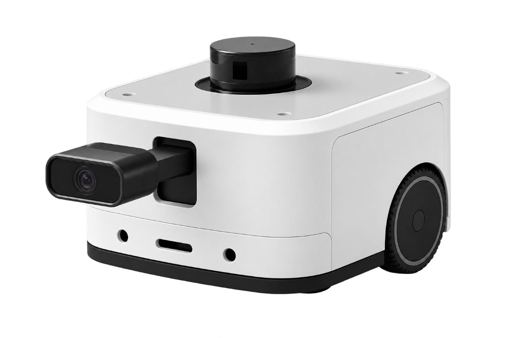

*발표 자료의 로봇 디자인 콘셉트*


**SSAFY 15기 공통 프로젝트 · 부울경 E101 · PRODUCE E101**

[프로젝트 소개](#overview) · [화면과 시연](#demo) · [아키텍처](#architecture) · [기술적 성과](#engineering) · [실행 안내](#getting-started) · [팀원](#team)

</div>

---

<a id="overview"></a>
## 프로젝트 소개

**삐용은 사람이 상주하지 않는 공장 내부를 순찰하며 화재 징후를 감지하고, 관제 웹에서 현장 상황과 대응 이력을 확인하는 시스템입니다.** 고정된 위치에서 감시하는 방식에 이동형 로봇을 더해 설비 주변과 미탐색 공간을 살펴봅니다.

로봇은 LiDAR로 지도를 만들고 위치를 추정합니다. 등록한 점검 지점을 순회하며 RGB 영상에서 불꽃·연기를 탐지하고, 열화상 정보를 함께 확인합니다. 운영자는 웹에서 지도, 로봇 영상, 상태, 이벤트 기록을 확인하고 수동 제어로 전환할 수 있습니다.

| 해결하려는 문제 | 삐용의 접근 |
| --- | --- |
| 사람이 없는 시간의 현장 확인 공백 | 자율 탐색과 점검 지점 순찰 |
| 고정 카메라만으로 확인하기 어려운 공간 | 지도 기반 이동과 현장 영상 확인 |
| 단일 영상의 일시적인 탐지 결과 | 연속 탐지 결과와 열화상을 활용한 확인 |
| 경보 이후 현장 상황과 이력을 파악하기 어려움 | 관제 화면에서 이벤트 목록과 상세 영상 확인 |

<a id="demo"></a>
## 화면과 시연

실제 로봇 촬영 영상과 팀 최종 발표 PPT의 기능별 관제 화면을 모았습니다. 관제 화면의 지도와 이벤트 값은 발표 당시의 데모 데이터입니다.

### 실제 로봇 자율주행 · 20초

박스 장애물을 배치한 실내 테스트 공간에서 실제 삐용 로봇이 이동하는 장면입니다. 원본 시연 영상의 **01:00~01:20** 구간을 발췌했으며, 재생 속도는 원본과 같습니다.

[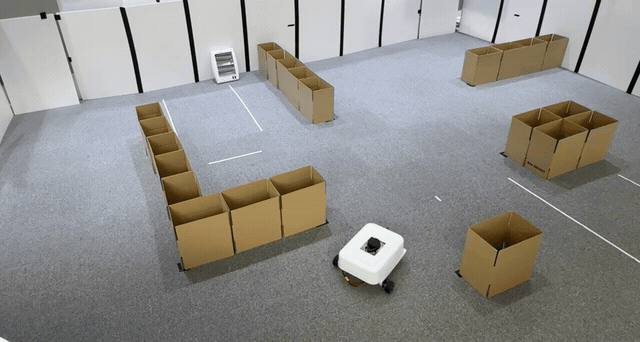](docs/assets/readme/autonomous-driving.mp4)

[20초 주행 영상 보기 · MP4, 약 0.5 MB](docs/assets/readme/autonomous-driving.mp4)

### 1. 지도 생성과 관제

탐색으로 수집한 지도를 확인하고, 3D 뷰에서 공간 구조를 살펴봅니다.

| 지도 관리 | 3D 공간 확인 |
| :---: | :---: |
| 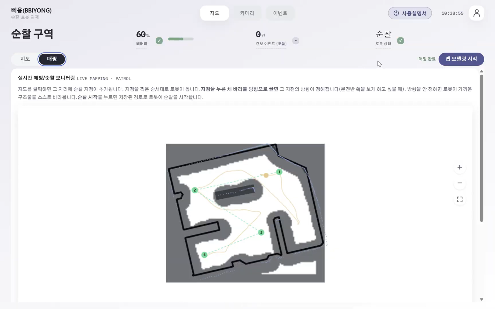 | 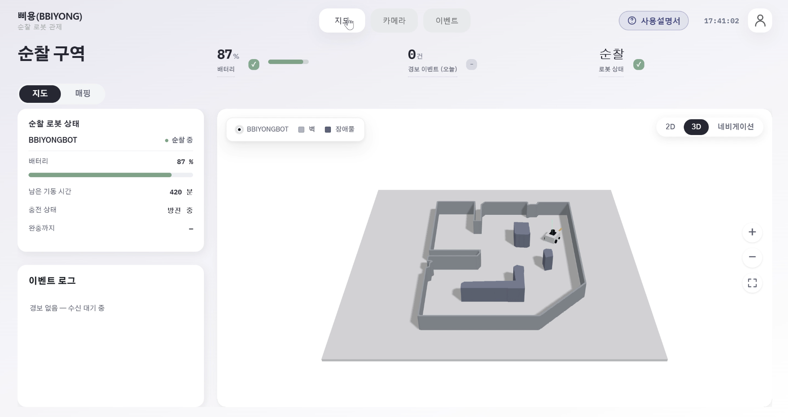 |

<details>
<summary><strong>지도 생성 과정 보기</strong></summary>

탐색 중 수집한 지도에서 벽과 이동 가능한 공간이 드러나는 과정입니다.

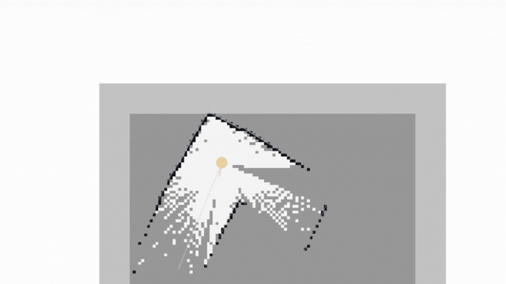

</details>

### 2. 미탐색 공간 탐색

Frontier 기반으로 알려진 공간과 미탐색 공간의 경계에서 다음 목표를 선택합니다. 지도 위의 로봇 이동과 탐색 영역 변화를 확인할 수 있습니다.

<p align="center">
  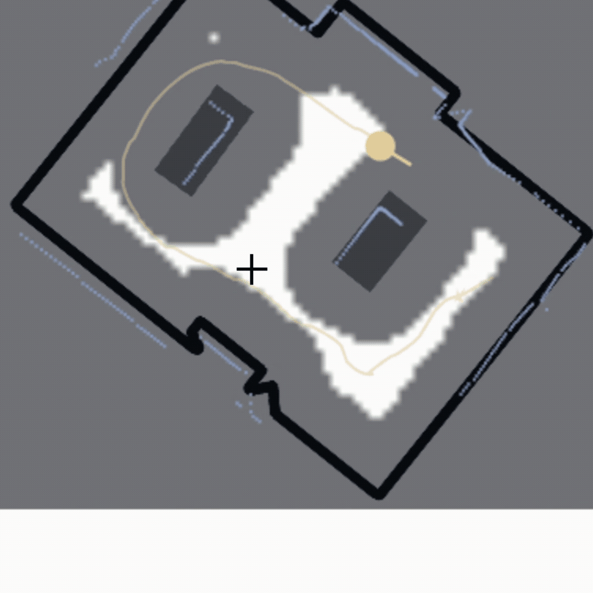
</p>

### 3. 순찰 설정과 우선 구역 반복 순찰

관제 화면에서 순찰 공간과 지점을 확인합니다. 발표 자료에서는 설정한 우선 구역을 차례로 방문하는 순찰 경로와 반복 주행을 보여줍니다.

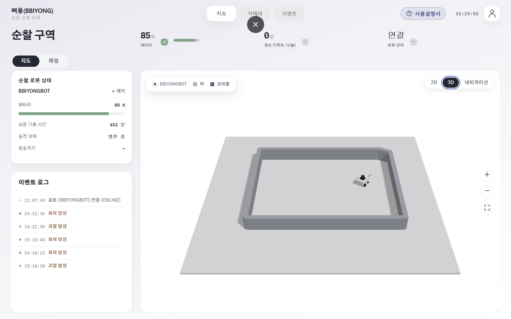

<details>
<summary><strong>순찰 경로와 반복 순찰 시연 보기</strong></summary>

| 순찰 경로 구성 | 지도 위 경로 확인 |
| :---: | :---: |
| 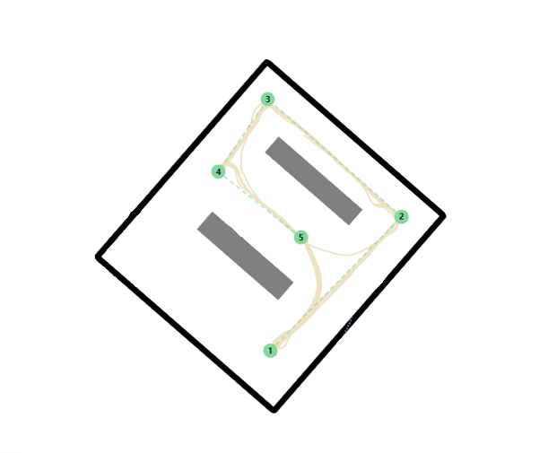 | 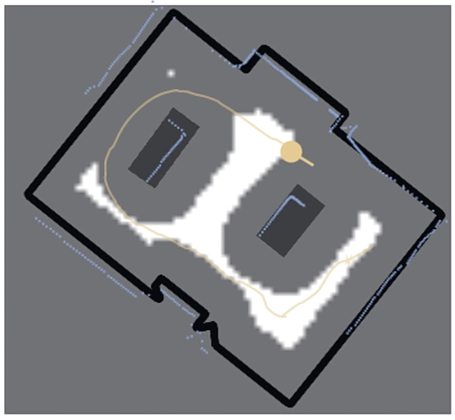 |

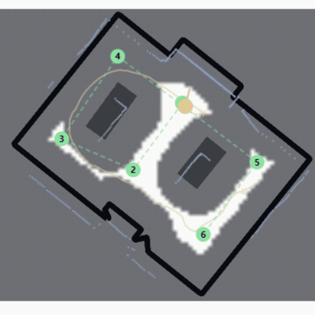

</details>

### 4. AI 화재 인식과 관제 경보

화재 이벤트가 발생하면 관제 화면에 경보를 표시합니다. 아래 화면은 발표 PPT의 화재 경보 시연입니다.

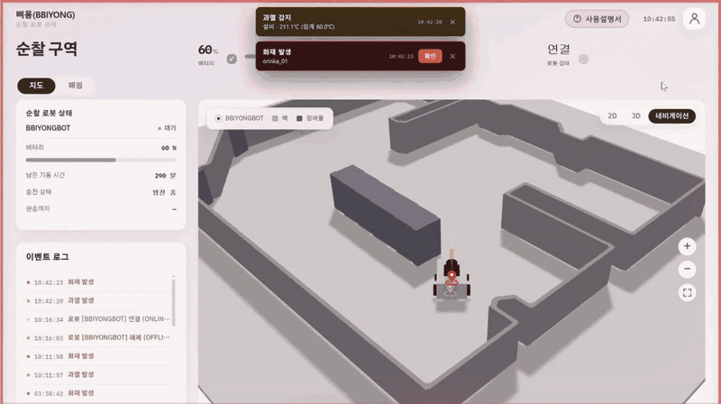

YOLO11n으로 불꽃과 연기를 탐지합니다. 아래 GIF는 발표에서 사용한 영상 기반 탐지 예시입니다.

<p align="center">
  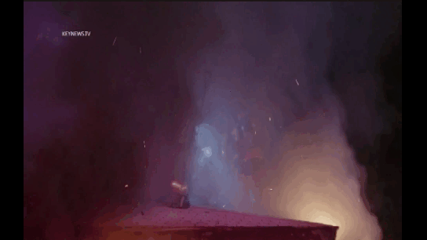
</p>

<details>
<summary><strong>RGB·열화상 확인 시연 펼치기</strong> · GIF 약 2.7 MB</summary>

불꽃을 보여주는 RGB 화면과 열화상 화면을 함께 확인하는 실험 장면입니다.

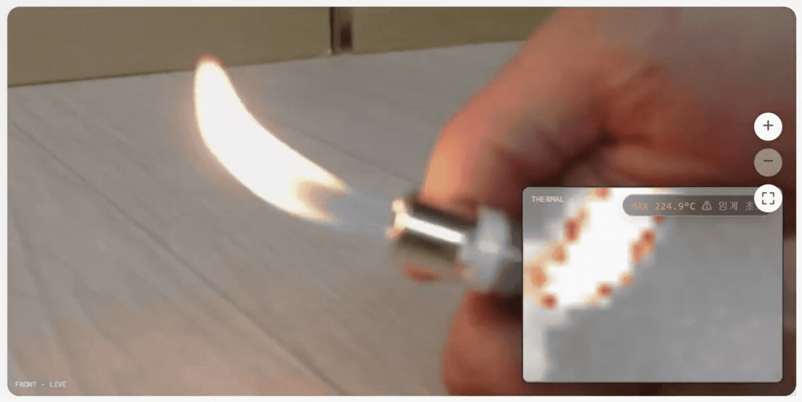

</details>

### 5. 이벤트 이력과 상세 확인

발생한 이벤트를 목록에서 조회하고, 상세 화면에서 관련 기록과 영상을 확인합니다. 발표 자료의 이벤트 목록 개요와 후속 목록 상태를 함께 담았습니다.

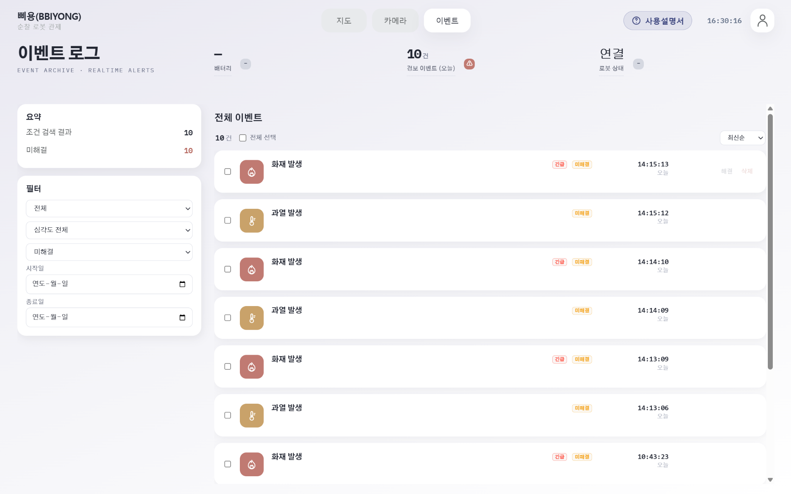

| 이벤트 목록 | 이벤트 상세 |
| :---: | :---: |
| 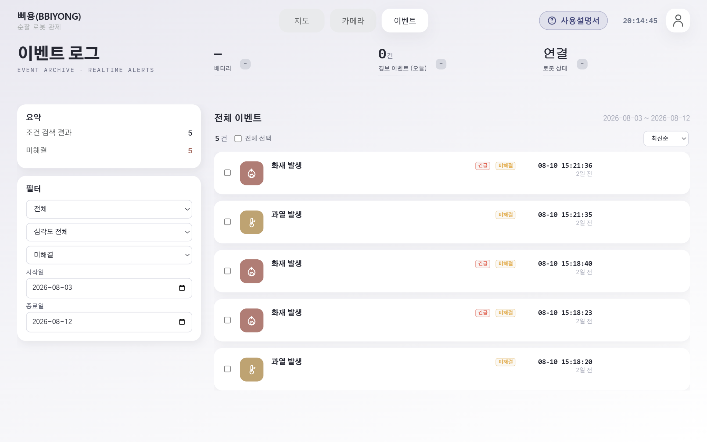 | 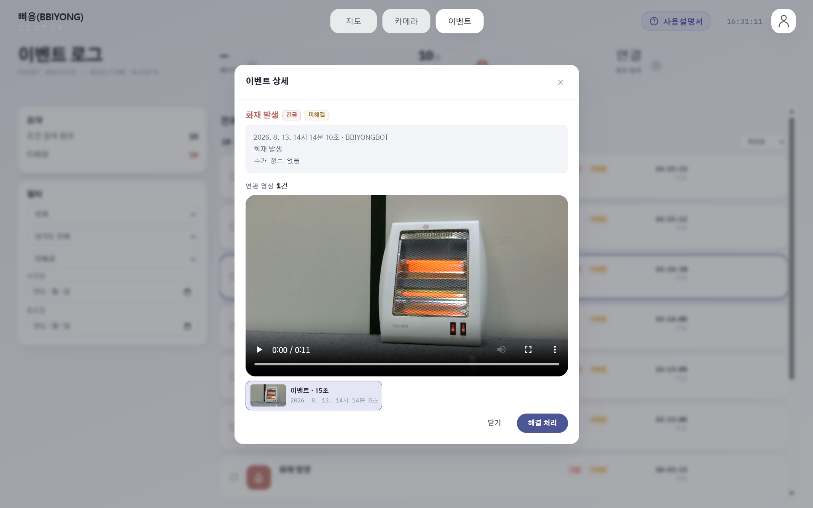 |

### 6. 주행 복구 동작

발표 자료에서 설명한 막힌 경로의 복구 동작입니다. 로봇이 회전·후진한 뒤 탐색을 재개하는 모습을 3D 지도에서 보여줍니다.

<p align="center">
  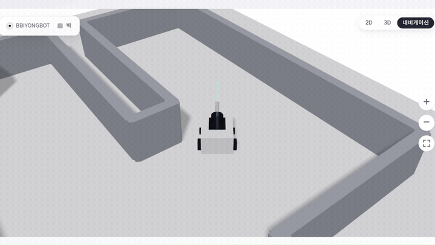
</p>

<a id="architecture"></a>
## 시스템 아키텍처

관제 UI, 관제 서버, 로봇 제어, AI 추론을 나누어 구성했습니다. 상태와 제어 명령은 WebSocket으로 전달하고, 실시간 영상은 별도의 스트리밍 경로로 제공합니다.

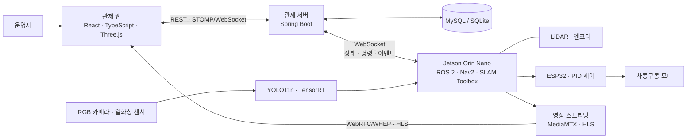

### 기술 스택

| 영역 | 기술 | 역할 |
| --- | --- | --- |
| Frontend | React 18, TypeScript, Vite, Three.js | 관제 UI, 지도 시각화, 로봇 제어 |
| 실시간 통신·영상 | STOMP/WebSocket, WebRTC/WHEP, HLS | 상태 구독, 제어 명령, 영상 재생 |
| Backend | Java 17, Spring Boot, Spring Security, JPA, JWT | 인증, 로봇 연결, 지도·이벤트 관리 |
| 데이터 | MySQL, SQLite | 운영·로컬 환경의 데이터 저장 |
| Robot | ROS 2 Humble, SLAM Toolbox, Nav2, AMCL | 지도 작성, 위치 추정, 경로 주행 |
| Hardware | Jetson Orin Nano, ESP32, YDLIDAR, MDD10A | 온디바이스 연산, 거리 측정, 모터 제어 |
| AI | Python, PyTorch, YOLO11n, ONNX, TensorRT | 불꽃·연기 탐지와 추론 최적화 |
| 배포 | Docker, Nginx, Jenkins | 서비스 배포와 파트별 CI/CD |

<a id="engineering"></a>
## 기술적 성과와 구현 포인트

### Jetson에서의 AI 추론 최적화

학습한 YOLO11n 모델을 ONNX로 내보내고 Jetson에서 TensorRT 엔진으로 변환했습니다. 동일한 FP16 정밀도로 비교했을 때 **전체 파이프라인 처리량이 33.37 FPS에서 70.60 FPS로 약 2.12배 증가**했습니다.

| 실행 방식 | 모델 추론 평균 | 전체 파이프라인 평균 | 처리량 |
| --- | ---: | ---: | ---: |
| PyTorch FP32 | 30.165 ms | 35.287 ms | 28.34 FPS |
| PyTorch FP16 | 24.744 ms | 29.970 ms | 33.37 FPS |
| TensorRT FP16 | **10.510 ms** | **14.170 ms** | **70.60 FPS** |

측정 기준: 2026-08-03, Jetson Orin, CUDA 12.6, TensorRT 10.3.0, 입력 640×640, batch 1. 같은 JPEG 40장을 5회 반복한 200프레임 기준입니다. 이 값은 **AI 추론 파이프라인 성능**이며 웹 영상의 송출 FPS나 전체 관제 지연을 의미하지 않습니다. [벤치마크 기록과 재현 방법](AI/deployment/fire_smoke/README.md#verified-jetson-result-2026-08-03)

### 지도·위치 추정·주행의 연결

SLAM Toolbox로 지도를 만들고, 저장된 지도에서 AMCL로 위치를 추정합니다. Frontier 탐색과 점검 지점 순찰을 Nav2 이동 목표로 연결합니다. 실제 구동부는 ESP32의 엔코더 피드백·PID 제어를 사용하는 차동구동 구조입니다.

- [Frontier 탐색 구현](BE_robot/ros2_ws/src/bbiyong_explorer/README.md)
- [점검 지점 관리와 순찰](BE_robot/ros2_ws/src/bbiyong_inspection/README.md)
- [모터·센서 배선 및 구동 구조](BE_robot/README.md)

### 영상과 제어 데이터의 분리

브라우저는 STOMP/WebSocket으로 상태를 구독하고 명령을 보냅니다. 전면 영상은 WebRTC/WHEP 경로와 HLS 재생 경로를 사용합니다. 영상과 탐지 결과가 서로 다른 시점에 도착하는 문제를 고려해 프런트엔드에 시간 보정 설정을 둡니다. [통신·영상 설정](FE/bbiyong-react/src/live/config.ts)

<a id="getting-started"></a>
## 실행 안내

전체 시스템은 관제 서버와 Jetson의 센서·로봇 실행 환경이 필요합니다. 웹 UI 개발은 아래 명령으로 시작할 수 있습니다.

### 관제 웹

Node.js와 npm을 설치한 뒤 실행합니다.

```bash
cd FE/bbiyong-react
npm ci
npm run dev
```

개발 서버는 기본적으로 `http://localhost:5173`에서 열립니다. 로컬 백엔드와 연결하려면 `FE/bbiyong-react/.env.local`에 다음을 지정합니다.

```dotenv
VITE_REST_BASE_URL=http://localhost:8080
VITE_WS_URL=ws://localhost:8080/ws/control
```

영상은 별도의 스트리밍 서버 설정이 필요합니다. `VITE_HLS_URL`, `VITE_WHEP_PATH` 등은 [설정 코드](FE/bbiyong-react/src/live/config.ts)를 참고하세요. 환경변수를 생략하면 코드에 지정된 기존 배포 서버 주소를 사용합니다.

### 관제 서버

Java 17과 저장소의 Gradle Wrapper를 사용합니다. 다음 환경변수를 설정한 뒤 `BE_system`에서 실행합니다.

| 환경변수 | 설명 |
| --- | --- |
| `BBIYONG_JWT_SECRET` | JWT 서명 키. 32바이트 이상 필수 |
| `BBIYONG_ROBOT_UPLOAD_TOKEN` | 로봇 연결·업로드 인증 토큰. 필수 |
| `SPRING_DATASOURCE_URL` | 생략하면 로컬 SQLite 사용. 외부 DB 사용 시 드라이버·방언도 함께 설정 |

```bash
cd BE_system
./gradlew bootRun
```

Windows PowerShell에서는 `./gradlew.bat bootRun`을 사용합니다. 추가 환경변수는 [서버 설정](BE_system/src/main/resources/application.properties)을 참고하세요.

### 로봇과 AI

- **로봇 실행 환경**: [ROS 2 워크스페이스](BE_robot/ros2_ws/README.md), [로봇 실행 도구](BE_robot/tools/README.md)
- **모델 학습**: [AI 학습 가이드](AI/README.md)
- **Jetson 배포**: [ONNX 변환·TensorRT 빌드·벤치마크](AI/deployment/fire_smoke/README.md)

학습 데이터와 모델 바이너리는 별도로 준비해야 합니다. 하위 문서에는 초기 차량 설계 기록도 포함되어 있으므로 실제 하드웨어 구성은 [현재 배선 문서](BE_robot/README.md)의 차동구동 구성을 기준으로 확인하세요.

## 저장소 구조

```text
.
├── FE/bbiyong-react/    # React 관제 웹
├── BE_system/          # Spring Boot 관제 서버
├── BE_robot/           # 로봇 펌웨어·도구·ROS 2 패키지
├── AI/                 # 모델 학습·평가·Jetson 배포
├── docs/               # 설계·API·발표 자료
│   └── assets/readme/  # 발표 PPT에서 추출한 README 이미지·GIF
└── Jenkinsfile.*       # 파트별 CI/CD
```

<a id="team"></a>
## 팀원

팀원별 담당 역할입니다.

| 이름 | 담당 |
| --- | --- |
| 모진성 | 팀장 · Backend |
| 장효준 | Hardware · AI |
| 고지혁 | Hardware · AI |
| 박재현 | CI/CD · Infra |
| 이승현 | Frontend · VP |
| 이예승 | Frontend · IP |

## 더 알아보기

- [시스템 아키텍처와 통신 명세](docs/architecture_and_api_spec.md)
- [백엔드 API 명세](docs/backend_api_specification.md)
- [프런트엔드·백엔드 연동 가이드](docs/fe_backend_integration_guide.md)
- [시각 자료 출처](docs/assets/readme/README.md)

---

<div align="center">

**삐용 · BBIYONG**<br/>
사람이 없는 시간에도, 공장의 상황을 확인할 수 있도록.

</div>
