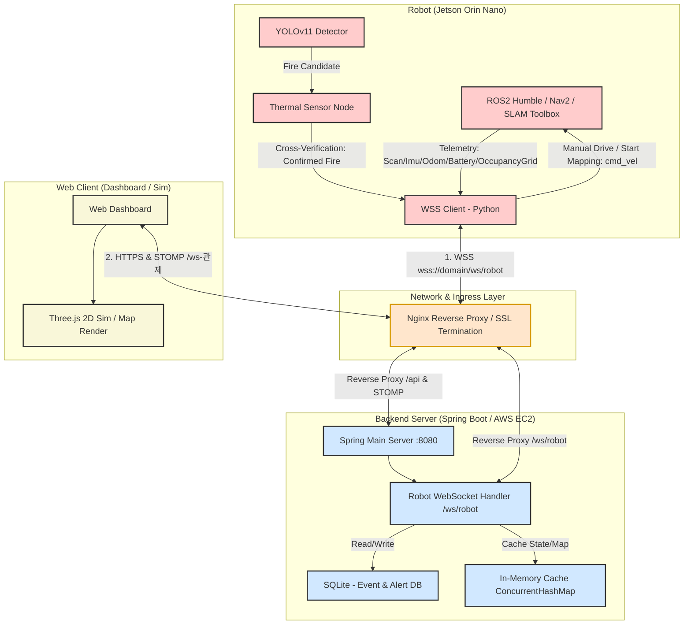
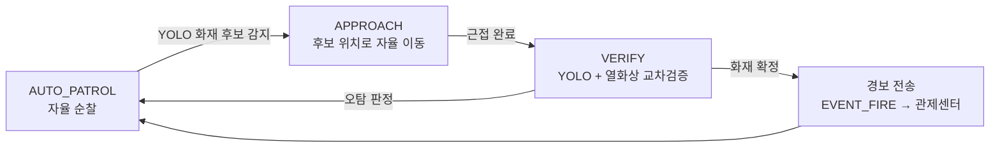
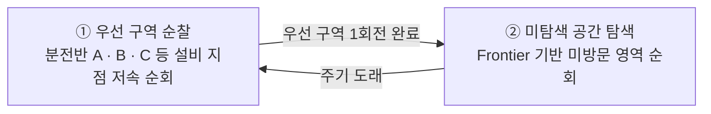
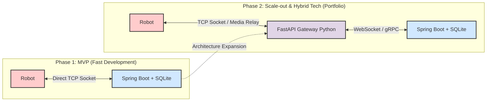

# 삐용 (BBIYONG) - 시스템 아키텍처 & API 명세

본 문서는 프로젝트 기획서 및 기능명세서를 바탕으로 설계한 초기 시스템 아키텍처 및 통신 프로토콜/API 명세를 정의합니다.

---

## 1. 시스템 아키텍처

삐용(BBIYONG) 프로젝트는 **이벤트 기반 아키텍처(Event-Driven Architecture)**와 **FSM(유한상태머신) 기반 로봇 제어**를 결합하여 설계되었습니다.

### 1.1 아키텍처 다이어그램 (1단계: MVP 개발 단일 아키텍처)



### 1.1.1 화재 탐지 및 경보 시퀀스 (로봇 자율 완결형)

고정형 CCTV 없이 **로봇이 순찰 중 스스로 화재를 탐지·검증·보고**하는 자율 완결형 플로우로 설계되었습니다.



* 순찰~검증(`APPROACH`, `VERIFY`) 단계는 로봇의 상태(`status`)로만 관제센터에 실시간 반영되며, **실제 경보(alert)는 교차검증으로 화재가 확정된 시점에만 1회 발송**됩니다(오탐 노이즈 방지).

### 1.1.2 평상시 순찰 모델 (2단계 우선순위)

로봇은 **사전에 완성된 2D 도면(맵)** 을 기반으로 자율주행하며, 다음 2단계 우선순위로 순찰합니다.



* **① 우선 구역 순찰**: 등록된 설비(분전반 등) waypoint를 우선 방문하여 과열/화재를 집중 감시합니다.
* **② 미탐색 탐색(Frontier)**: 우선 구역 순회 후, 아직 방문하지 않은 공간을 프론티어 방식으로 순회하여 커버리지를 확보합니다.
* 관제센터는 자율 순찰(`SET_MODE autonomy`)과 수동 조종(`SET_MODE manual`)을 실시간 전환할 수 있으며, 특정 좌표로의 직접 이동(`NAVIGATE`)을 지시할 수 있습니다.

> **MVP 구현 범위 (로봇 제어)**: 이번 MVP에서는 **자동 순찰(`SET_MODE autonomy`) · 수동 조종 WASD(`SET_MODE manual` + `DRIVE`) · 순찰 복귀(= `SET_MODE autonomy`)** 만 관제 UI에 연결합니다.
> `ESTOP`·`NAVIGATE`(지점 이동)·`SAVE_MAP`은 로봇이 지원하나 UI 연결은 후속(Deferred)이며, 프로토타입의 전조등·경고 방송·볼륨은 로봇 프로토콜 미지원으로 향후 펌웨어 확장 대상입니다. (명령 계약은 [2.1](#21-오린카-leftrightarrow-spring-boot-websocket-secure---wss-json-protocol) 참조)

### 1.2 컴포넌트별 주요 역할

1. **오린카 (Jetson Orin Nano)**:
   * **주행**: LiDAR 센서를 활용해 2D 지도를 작성(SLAM Toolbox)하고, `robot_localization`을 통한 EKF 센서 융합(오도메트리+IMU)으로 자율주행 순찰(Nav2) 및 장애물 회피를 처리합니다. 순찰은 완성된 2D 도면을 기반으로 [1.1.2](#112-평상시-순찰-모델-2단계-우선순위)의 우선 구역 → 미탐색 탐색 2단계로 수행합니다.
   * **자율 화재 탐지 (완결형)**: 순찰 중 RGB 카메라 영상으로 YOLO 추론을 수행하여 화재 후보를 탐지하면, 스스로 해당 위치 근처로 이동(`APPROACH`)한 뒤 근접 상태에서 YOLO 객체탐지와 열화상(Thermal) 데이터를 대조(교차검증, `VERIFY`)합니다. 화재로 확정된 경우에만 백엔드로 확정 경보(`EVENT_FIRE`)를 전송하여 비화재 오탐(빛 반사 등)을 원천 차단합니다.
   * **듀얼 영상 릴레이**: 전방 RGB 카메라(YOLO 오버레이)와 동일 방향 열화상(Thermal) 카메라 프레임을 각각 JPEG로 인코딩·base64 텍스트 프레임으로 WSS 스트리밍합니다. 백엔드는 이를 STOMP로 중계하여 관제 대시보드에 RGB/열화상을 나란히 표시합니다.
   * **확장 텔레메트리**: 위치·배터리·상태 외에 속도(m/s), E-STOP 상태, 통신 지연(ms), 추론 FPS를 주기적으로 전송합니다. (온습도 센서는 미사용)
   * **상태 및 수동 조종**: `SET_MODE` 명령으로 `autonomy`(자율 순찰) ↔ `manual`(수동 조종) ↔ `disabled`(정지) 를 전환합니다. `manual` 모드 시 백엔드로부터 WSS로 전달된 `DRIVE`(WASD 변환) 명령을 `/cmd_vel`(Twist)로 변환하여 구동합니다.
   * **맵 저장 (후속/Deferred)**: `SAVE_MAP` 명령으로 현재 SLAM 맵을 저장합니다. (관제 UI 연결 및 맵 상향 스트리밍은 후속)
2. **Nginx 게이트웨이 & 리버스 프록시 (Ingress Layer)**:
   * 단일 SSL/TLS 인증서 종단점(Termination) 역할을 수행하여 443(HTTPS/WSS) 포트 통신을 전담 처리합니다.
   * 웹 정적 아티팩트(React), 백엔드 REST API(`/api/*`), 웹 관제 웹소켓(`/ws-관제`), 로봇 WSS(`/ws/robot`) 요청을 적절한 내부 포트로 리버스 프록시 라우팅합니다.
3. **메인 백엔드 (Spring Boot / AWS EC2)**:
   * **로봇 WSS 핸들러 내장**: Nginx로부터 전달받은 WSS 소켓 연결(`/ws/robot`)을 수신하고 명령 및 상태 데이터를 실시간 양방향 송수신합니다.
   * **자율 경보 수신 및 푸시**: 로봇이 교차검증으로 확정한 화재 이벤트(`EVENT_FIRE`)를 수신하면 즉시 SQLite에 이력을 저장하고 STOMP `/topic/alerts` 로 관제 대시보드에 경보를 브로드캐스트합니다.
   * **제어 명령 중계**: 웹 대시보드가 STOMP `/app/control/*` 로 보낸 제어(`DRIVE`/`SET_MODE`/`ESTOP`/`SAVE_MAP`/`NAVIGATE`)를 검증(`validate`) 후 로봇 WSS 세션으로 중계합니다.
   * **듀얼 영상 중계**: 로봇의 `VIDEO_FRAME`(RGB/열화상)을 STOMP `/topic/video/{robotId}` 로 중계합니다.
   * **상태 캐싱 및 실시간 푸시**: 로봇의 실시간 상태를 자바 내장 메모리(**ConcurrentHashMap**)에 캐싱하여 관리 효율을 높이고, 실시간 데이터와 상태를 웹소켓(STOMP)으로 대시보드에 브로드캐스팅합니다.
   * **데이터 저장**: 이벤트 로그와 알림 이력을 SQLite에 저장합니다.

---

### 1.3 Nginx 리버스 프록시 & WSS(WebSocket Secure) 채택 이유

AWS 인프라 환경 및 실제 공장/네트워크 보안 요구사항을 반영하여 **로봇-서버 통신 프로토콜을 Raw TCP에서 WSS(WebSocket Secure)로 채택**하고 **Nginx 리버스 프록시**를 도입하였습니다.

1. **AWS 및 기업 방화벽 통과 (AWS Security Group & NAT Firewall)**:
   * AWS EC2, SSAFY 내부망, 공장 모바일 모뎀(LTE/5G) 방화벽은 9000번 등 임의의 커스텀 TCP 포트 입출력을 엄격히 차단합니다.
   * WSS는 표준 **HTTPS 443번 포트**를 이용하므로 방화벽 설정 변경 없이 100% 정상 통과합니다.
2. **Nginx를 통한 단일 SSL/TLS 인증서 및 엔드포인트 관리**:
   * Nginx가 최전방에서 SSL 종단(TLS Termination)을 담당함으로써 백엔드 애플리케이션의 인증서 처리 부하를 제거하고, 정적 파일/REST API/웹소켓 라우팅을 443 단일 포트로 통합 관리합니다.
3. **종단간(End-to-End) 데이터 암호화 (보안 강화)**:
   * 무선 네트워크(Wi-Fi/LTE) 환경에서 로봇 제어 명령(`cmd_vel`) 및 이상 탐지 데이터의 중간 패킷 도청, 변조(Man-in-the-Middle) 공격을 차단합니다.
4. **AWS ALB / Nginx 웹소켓 업그레이드 호환성**:
   * HTTP 101 Switching Protocols 표준을 준수하여 AWS ALB(L7 로드밸런서) 및 Nginx 환경에서 무중단 실시간 연결 및 로드 밸런싱 처리가 용이합니다.

---

## 2. 초기 API 및 통신 프로토콜 명세

### 2.1 오린카 $\leftrightarrow$ Spring Boot (WebSocket Secure - WSS JSON Protocol)

* **엔드포인트**: `wss://<domain>/ws/robot` (Nginx 리버스 프록시를 통해 Spring Boot 백엔드로 포워딩)
* **데이터 규격**: WebSocket Text Frame 기반 JSON 객체 전송

#### 1) 로봇 상태 및 모드 전송 (Robot $\rightarrow$ Spring Boot)
```json
{
  "source": "robot",
  "type": "STATE_UPDATE",
  "robot_id": "orinka_01",
  "location": { "x": 12.34, "y": 5.67, "yaw": 1.57 },
  "battery": 88.5,
  "status": "AUTO_PATROL",
  "speed": 0.6,
  "estop": "RELEASED",
  "commLatencyMs": 43,
  "inferenceFps": 8.0,
  "timestamp": 1781778100
}
```
* `status` 항목(로봇이 보고하는 상위 FSM 상태): `AUTO_PATROL`(자율 순찰), `APPROACH`(화재 후보 위치 자율 접근), `VERIFY`(근접 교차검증), `MANUAL_CONTROL`(직접 조종), `MAPPING`(후속)
* ⚠️ **명령 `mode`(`autonomy`/`manual`/`disabled`)와 보고 `status`는 별개 축**이다. 명령 mode는 로봇 계약([2.1 4)](#mvp-4-로봇-구동-모드-제어-명령-spring-boot-rightarrow-robot))을 따르고, 상위 `status` 값의 정확한 문자열은 로봇 상향 텔레메트리 구현과 함께 확정한다.
* 확장 필드: `speed`(m/s), `estop`(`RELEASED`/`ENGAGED`), `commLatencyMs`(통신 왕복 지연), `inferenceFps`(YOLO 추론 FPS)
* ℹ️ 온습도(주변 온도·습도)는 온습도 센서 미사용으로 텔레메트리에서 제외한다.

#### 1-1) 듀얼 카메라 영상 프레임 (Robot $\rightarrow$ Spring Boot)
* **설명**: 전방 RGB와 열화상 프레임을 각각 JPEG→base64로 인코딩하여 전송합니다. 백엔드는 STOMP `/topic/video/{robotId}` 로 중계하며, 대시보드가 RGB/열화상을 나란히 렌더링합니다. `channel`로 두 스트림을 구분합니다.
```json
{
  "source": "robot",
  "type": "VIDEO_FRAME",
  "robot_id": "orinka_01",
  "channel": "FRONT",
  "format": "jpeg",
  "data": "<base64-encoded JPEG>",
  "maxTemp": null,
  "seq": 1024,
  "timestamp": 1781778101
}
```
* `channel` 항목: `FRONT`(RGB·YOLO 오버레이) 또는 `THERMAL`(열화상). `THERMAL`인 경우 `maxTemp`(최대 온도 ℃)를 함께 전송합니다.

#### 2) 교차검증 화재 이벤트 전송 (Robot $\rightarrow$ Spring Boot)
* **설명**: 로봇이 `APPROACH` → `VERIFY`(YOLO 객체탐지 + 열화상)를 거쳐 **화재로 확정한 시점에만** 1회 전송합니다. 후보 감지/접근 단계는 경보가 아닌 `STATE_UPDATE`(status)로만 반영됩니다.
```json
{"source": "robot", "type": "EVENT_FIRE", "robot_id": "orinka_01", "confidence": 0.94, "temperature": 58.4, "location": {"x": 15.0, "y": 8.2}, "timestamp": 1781778200}
```

#### [미확정/Deferred] 3) 2D 도면 매핑 점유 격자 스트리밍 (Robot $\rightarrow$ Spring Boot)
* ⚠️ **로봇 프로토콜 미지원 항목**: 현재 로봇 명령 계약에는 맵 스트리밍이 없고 `SAVE_MAP`(맵 저장)만 존재한다. 아래 `MAP_UPDATE` occupancy grid 실시간 스트리밍은 **로봇의 맵 상향 스트리밍 능력이 확인된 뒤** 확정한다(현재는 미확정). 확정 시 백엔드가 STOMP `/topic/map` 으로 중계한다.
```json
{
  "source": "robot",
  "type": "MAP_UPDATE",
  "robot_id": "orinka_01",
  "resolution": 0.05,
  "width": 200,
  "height": 200,
  "origin": { "x": -5.0, "y": -5.0 },
  "data": [-1, 0, 0, 100, "...(row-major occupancy: -1 미탐색 / 0 자유 / 100 점유)"],
  "timestamp": 1781778300
}
```

> **로봇 명령 계약(ground truth)**: 아래 다운스트림 명령은 로봇 `remote_control_protocol.py` 가 정의하는 계약을 그대로 따른다. 관제 명령은 REST가 아니라 **STOMP `/app/control/*` → WSS 중계**로 전달된다([2.3](#23-실시간-웹소켓websocket-토픽-구조-spring-boot-leftrightarrow-web-client) 참조).

##### [MVP] 4) 로봇 구동 모드 제어 명령 (Spring Boot $\rightarrow$ Robot)
```json
{"command": "SET_MODE", "mode": "manual"}
```
* `mode` 항목: **`autonomy`**(자율 순찰), **`manual`**(수동 조종), **`disabled`**(정지/비활성)
* **순찰 복귀는 별도 명령이 아니라 `SET_MODE mode=autonomy`** 로 처리한다. (로봇 프로토콜에 `RESUME` 없음)

##### [MVP] 5) 수동 조종 방향 명령 (Spring Boot $\rightarrow$ Robot)
* **설명**: 웹 관제센터의 WASD 입력을 선속도/각속도로 매핑하여 릴레이한다. `manual` 모드에서 유효하며, 로봇이 `max_linear`/`max_angular` 로 클램핑한다.
```json
{"command": "DRIVE", "linear": 0.5, "angular": -0.1}
```

##### [후속/Deferred] 6) 그 외 로봇 지원 명령 (Spring Boot $\rightarrow$ Robot)
* 로봇 프로토콜에 정의되어 있으나 관제 UI 연결은 MVP 이후.

| command | 페이로드 | 설명 |
| :--- | :--- | :--- |
| `ESTOP` | `{"active": true}` | 긴급 정지 (활성화만 허용, fail-safe) |
| `NAVIGATE` | `{"x": 15.0, "y": 8.2, "yaw": 0.0}` | 지정 좌표로 이동 (프로토타입의 "지점 이동") |
| `SAVE_MAP` | `{"name": "factory_01"}` | 현재 SLAM 맵 저장 (safe basename) |

* 프로토타입 UI의 **전조등 · 경고 방송 · 볼륨**은 현재 로봇 프로토콜에 없음 → 로봇 펌웨어 확장 후 명령 정의 예정.

---

### 2.2 메인 서버 (Spring Boot) REST API 명세 (Web Client 용)

> **제어는 REST가 아니라 STOMP**: 로봇 실시간 제어(모드/주행 등)는 REST가 아닌 STOMP `/app/control/*` 로 전달된다([2.3](#23-실시간-웹소켓websocket-토픽-구조-spring-boot-leftrightarrow-web-client)). REST는 인증과 조회(read)만 담당한다.

| 구분 | HTTP Method | API Path | 설명 | Request Body / Query | Response Body |
| :--- | :--- | :--- | :--- | :--- | :--- |
| MVP | **POST** | `/api/auth/signup` | 관리자 회원가입 (이메일 기반) | `{"email": "safety@bbiyong.io", "password": "...", "name": "..."}` | `{"status": "SUCCESS", "email": "safety@bbiyong.io"}` |
| MVP | **POST** | `/api/auth/login` | 관리자 로그인 (이메일 기반) | `{"email": "safety@bbiyong.io", "password": "..."}` | `{"tokenType": "Bearer", "accessToken": "JWT", "role": "ROLE_ADMIN"}` |
| MVP | **GET** | `/api/robots` | 로봇 목록/상태 요약 조회 | None | `[{"robotId": "orinka_01", "status": "AUTO_PATROL", "battery": 71}]` |
| MVP | **GET** | `/api/events` | 이상 탐지 이벤트 이력 조회 (SQLite) | `?page=0&size=10` | `{"content": [{"eventId": 1, "type": "FIRE", ...}]}` |
| 후속 | **PUT** | `/api/equipments/{id}` | 설비(분전반) 경보 임계 온도 설정 | `{"threshold": 55.0}` | `{"status": "SUCCESS"}` |

> **인증 주의**: 회원가입/로그인은 이메일 기반이며, 로그인 성공 시 JWT를 발급합니다. (인가 필터 적용은 후속 — 현재는 엔드포인트 오픈)

---

### 2.3 실시간 웹소켓(WebSocket) 토픽 구조 (Spring Boot $\leftrightarrow$ Web Client)

* **엔드포인트**: `/ws-관제`(및 `/ws/control`, SockJS 지원), app prefix `/app`, broker prefix `/topic`
* **구독 토픽 (Sub, `/topic`)**:
  * `/topic/robots`: 실시간 로봇 텔레메트리(위치, `status`, 배터리, 속도, E-STOP, 통신 지연, 추론 FPS) 갱신
  * `/topic/alerts`: 로봇이 교차검증으로 확정한 화재 경보 실시간 푸시(`source: ROBOT`)
  * `/topic/video/{robotId}`: 로봇 듀얼 카메라 프레임 중계 — `channel`(`FRONT`/`THERMAL`)로 구분되는 base64 JPEG 프레임
  * `/topic/map` *(미확정/후속)*: 로봇 맵 스트리밍 능력 확인 시 2D 점유 격자 중계
* **발행 목적지 (Pub, `/app/control/*`)** — 백엔드가 payload를 검증(`validate`) 후 로봇 WSS 명령으로 중계. `robot_id` 는 payload에 포함(기본 `orinka_01`):
  * `/app/control/drive` → `DRIVE` (수동 주행, `manual` 모드에서 유효)
    ```json
    {"robot_id": "orinka_01", "command": "DRIVE", "linear": 0.5, "angular": -0.1}
    ```
  * `/app/control/mode` → `SET_MODE`(`mode`: `autonomy`/`manual`/`disabled`) 또는 `ESTOP`
    ```json
    {"robot_id": "orinka_01", "command": "SET_MODE", "mode": "autonomy"}
    ```
  * `/app/control/operation` → `SAVE_MAP`(`name`) 또는 `NAVIGATE`(`x`,`y`,`yaw`) *(후속)*

---

## 3. 점진적 아키텍처 확장 로드맵 (포트폴리오 고도화 전략)

본 프로젝트는 4주 개발 일정을 고려해 **1단계: Spring Boot 단일 백엔드 아키텍처**로 구현을 시작하여 신속하게 MVP를 완성합니다. 이후 추가적인 성능 고도화 및 이종 백엔드 기술 경험(포트폴리오 강화)을 위해 **2단계: FastAPI 게이트웨이 분리 아키텍처**로 진화하는 로드맵을 설계했습니다.



### 2단계 확장 시 이점 (포트폴리오 가치)
1. **비디오 스트리밍 오버헤드 분리**: OpenCV/Media 가공 능력이 뛰어난 파이썬 기반 FastAPI 게이트웨이를 독립시킴으로써, 자바/Spring Boot 메인 서버는 비즈니스 로직과 웹소켓 알림 처리에만 전념하도록 CPU 연산 부하를 차단합니다.
2. **이종 백엔드(Hybrid Backend) 협업 경험**: 대규모 분산환경에서 사용되는 Gateway 패턴을 직접 설계하고 구현하여, 자바와 파이썬이라는 이종 플랫폼 간의 네트워크 통신(gRPC 또는 WebSocket) 정합성 처리 경험을 증명합니다.


