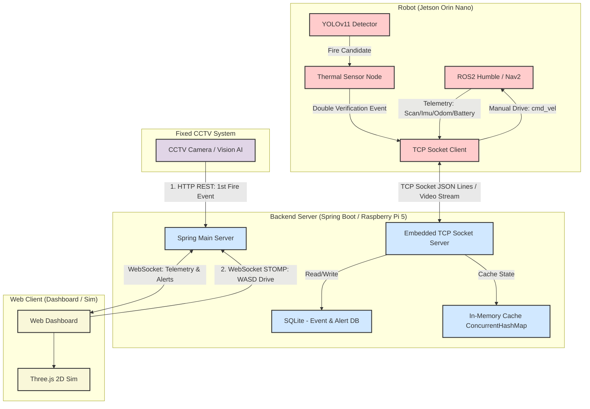
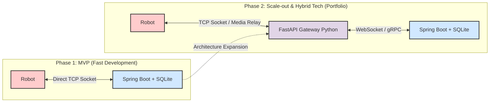

# 삐용 (BBIYONG) - 시스템 아키텍처 & API 명세 및 Jira 백로그

본 문서는 프로젝트 기획서 및 기능명세서를 바탕으로 설계한 초기 시스템 아키텍처, 통신 프로토콜/API 명세, 그리고 Jira에 즉시 등록하여 사용할 수 있는 1~2주차 티켓 백로그 목록을 정의합니다.

---

## 1. 시스템 아키텍처

삐용(BBIYONG) 프로젝트는 **이벤트 기반 아키텍처(Event-Driven Architecture)**와 **FSM(유한상태머신) 기반 로봇 제어**를 결합하여 설계되었습니다.

### 1.1 아키텍처 다이어그램 (1단계: MVP 개발 단일 아키텍처)



### 1.2 컴포넌트별 주요 역할

1. **오린카 (Jetson Orin Nano)**:
   * **주행**: LiDAR 센서를 활용해 2D 지도를 작성(SLAM Toolbox)하고, `robot_localization`을 통한 EKF 센서 융합(오도메트리+IMU)으로 자율주행 순찰(Nav2) 및 장애물 회피를 처리합니다.
   * **탐지**: 일반 카메라 영상으로 YOLO 추론을 수행하여 화재 후보를 탐지하고, 열화상 데이터와 대조(이중 판정)하여 비화재 오탐(빛 반사 등)을 원천 차단합니다.
   * **상태 및 수동 조종**: 자율 순찰 모드(AUTO_PATROL) ↔ 수동 조종 모드(MANUAL_CONTROL) 간 FSM 전환을 지원합니다. 수동 조종 모드 시 백엔드로부터 전달된 WASD 제어 명령을 `/cmd_vel` 토픽으로 변환하여 구동하고, 실시간 비디오 프레임을 릴레이합니다.
2. **고정형 CCTV 시스템 (Fixed CCTV System)**:
   * 공장 내부를 고정 감시하며 비전 AI를 통해 연기/화재를 1차로 실시간 감지합니다.
   * 화재 감지 시, 해당 화재가 발생한 공간 좌표 정보를 포함한 이벤트를 Spring Boot 백엔드로 즉시 전송(`POST /api/cctv/events`)합니다.
3. **메인 백엔드 (Spring Boot / Raspberry Pi 5)**:
   * **TCP 소켓 서버 내장**: 로봇(젯슨)으로부터 직접 TCP 소켓 연결을 수신하고 명령 및 상태를 실시간 송수신합니다.
   * **CCTV 연동 및 자동 출동**: CCTV로부터 1차 화재 이벤트를 수신하면, 즉시 로봇의 순찰 모드를 긴급 출동 상태로 전환시키고 해당 좌표로 출동 명령(`DISPATCH`)을 소켓으로 전송합니다.
   * **수동 제어 릴레이**: 웹 브라우저에서 들어오는 실시간 WASD 웹소켓(STOMP) 제어 명령을 로봇의 TCP 소켓 패킷으로 변환하여 실시간 중계합니다.
   * **상태 캐싱 및 실시간 푸시**: 로봇의 실시간 상태를 자바 내장 메모리(**ConcurrentHashMap**)에 캐싱하여 관리 효율을 높이고, 실시간 영상(릴레이)과 상태 데이터를 웹소켓으로 대시보드에 브로드캐스팅합니다.
   * **데이터 저장**: 이벤트 로그와 알림 이력을 SQLite에 저장합니다.

---

## 2. 초기 API 및 통신 프로토콜 명세

### 2.1 오린카 $\leftrightarrow$ Spring Boot (TCP Socket - JSON Lines)

오린카(로봇)와 Spring Boot 간에는 매 라인 끝에 `\n` 개행을 포함하는 JSON Lines 규격을 활용합니다.

#### 1) 로봇 상태 및 모드 전송 (Robot $\rightarrow$ Spring Boot)
```json
{
  "source": "robot",
  "type": "STATE_UPDATE",
  "robot_id": "orinka_01",
  "location": { "x": 12.34, "y": 5.67, "yaw": 1.57 },
  "battery": 88.5,
  "status": "AUTO_PATROL",
  "timestamp": 1781778100
}
```
* `status` 항목: `AUTO_PATROL`(자율 순찰), `MANUAL_CONTROL`(직접 조종), `DISPATCH`(긴급 출동), `VERIFY`(근접 확인)

#### 2) 이중 판정 화재 이벤트 전송 (Robot $\rightarrow$ Spring Boot)
```json
{"source": "robot", "type": "EVENT_FIRE", "robot_id": "orinka_01", "confidence": 0.94, "temperature": 58.4, "location": {"x": 15.0, "y": 8.2}, "timestamp": 1781778200}
```

#### 3) 로봇 구동 모드 제어 명령 (Spring Boot $\rightarrow$ Robot)
```json
{"command": "SET_MODE", "mode": "MANUAL_CONTROL"}
```
* `mode` 항목: `AUTO_PATROL` 또는 `MANUAL_CONTROL`

#### 4) 수동 조종 방향 명령 (Spring Boot $\rightarrow$ Robot)
* **설명**: 웹 관제센터에서 입력한 WASD 키값을 선속도/각속도 값(ROS 2 Twist 메시지 변환용)으로 매핑하여 로봇에 직접 릴레이합니다.
```json
{"command": "DRIVE", "linear": 0.5, "angular": -0.1}
```

---

### 2.2 메인 서버 (Spring Boot) REST API 명세 (Web Client 및 CCTV 용)

| HTTP Method | API Path | 설명 | Request Body / Query | Response Body |
| :--- | :--- | :--- | :--- | :--- |
| **POST** | `/api/auth/login` | 관리자 로그인 | `{"username": "...", "password": "..."}` | `{"token": "JWT_TOKEN", "role": "ADMIN"}` |
| **GET** | `/api/robots` | 관리 권한이 있는 로봇 목록 조회 | None | `[{"robot_id": "orinka_01", "status": "AUTO_PATROL"}]` |
| **POST** | `/api/robots/{id}/mode` | 로봇 순찰 모드 변경 (자율순찰/수동조종) | `{"mode": "MANUAL_CONTROL"}` | `{"status": "SUCCESS", "currentMode": "MANUAL_CONTROL"}` |
| **POST** | `/api/cctv/events` | CCTV 1차 화재 감지 이벤트 수신 (자동출동 트리거) | `{"cctv_id": "cctv_04", "location": {"x": 15.0, "y": 8.2}, "confidence": 0.88}` | `{"status": "DISPATCHED", "assigned_robot": "orinka_01"}` |
| **GET** | `/api/events` | 이상 탐지 이벤트 이력 조회 (SQLite) | `?page=0&size=10` | `{"content": [{"event_id": 1, "type": "FIRE", ...}]}` |
| **PUT** | `/api/equipments/{id}` | 특정 설비의 경보 임계 온도 설정 | `{"threshold": 55.0}` | `{"status": "SUCCESS"}` |

---

### 2.3 실시간 웹소켓(WebSocket) 토픽 구조 (Spring Boot $\leftrightarrow$ Web Client)

* **구독 토픽 (Sub)**:
  * `/topic/robots`: 실시간 로봇 위치, 모드(`status`), 배터리 상태 갱신
  * `/topic/alerts`: CCTV 및 로봇에 의한 실시간 경보 푸시
* **발행 토픽 (Pub)**:
  * `/app/robot/{id}/manual-drive`: 웹 관제화면 WASD 키 입력을 수동 주행 명령으로 변환하여 발행
```json
{
  "linear": 0.5,
  "angular": -0.1
}
```

---

## 3. 점진적 아키텍처 확장 로드맵 (포트폴리오 고도화 전략)

본 프로젝트는 4주 개발 일정을 고려해 **1단계: Spring Boot 단일 백엔드 아키텍처**로 구현을 시작하여 신속하게 MVP를 완성합니다. 이후 추가적인 성능 고도화 및 이종 백엔드 기술 경험(포트폴리오 강화)을 위해 **2단계: FastAPI 게이트웨이 분리 아키텍처**로 진화하는 로드맵을 설계했습니다.



### 2단계 확장 시 이점 (포트폴리오 가치)
1. **비디오 스트리밍 오버헤드 분리**: OpenCV/Media 가공 능력이 뛰어난 파이썬 기반 FastAPI 게이트웨이를 독립시킴으로써, 자바/Spring Boot 메인 서버는 비즈니스 로직과 웹소켓 알림 처리에만 전념하도록 CPU 연산 부하를 차단합니다.
2. **이종 백엔드(Hybrid Backend) 협업 경험**: 대규모 분산환경에서 사용되는 Gateway 패턴을 직접 설계하고 구현하여, 자바와 파이썬이라는 이종 플랫폼 간의 네트워크 통신(gRPC 또는 WebSocket) 정합성 처리 경험을 증명합니다.

