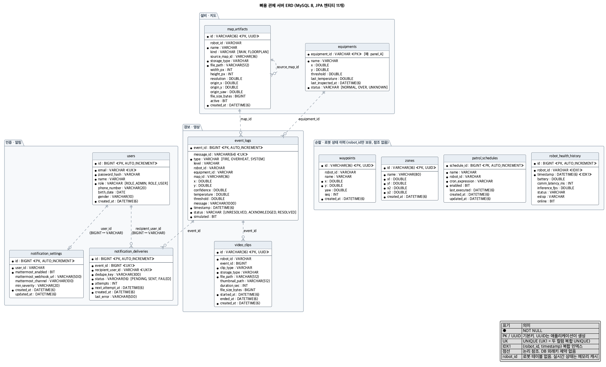
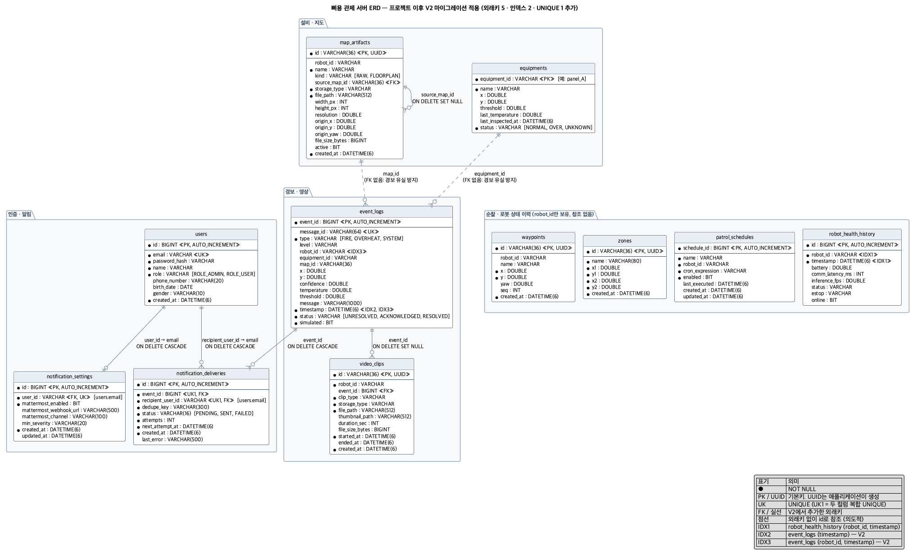

# 프로젝트 이후 개선 기록 (개인 작업)

> 이 폴더의 작업은 **팀 프로젝트가 끝난 뒤(2026-09) 개인 GitHub 저장소에서만** 진행했습니다. 팀 GitLab 저장소와 배포 서버에는 반영되지 않았습니다.

프로젝트를 정리하면서 ERD를 그려 보니 세 가지 문제가 보였습니다.

1. `event_logs`를 시간 범위로 조회하는데 인덱스가 없다.
2. 테이블 사이에 DB 외래키가 하나도 없다.
3. 스키마를 Hibernate `ddl-auto=update`로 관리해서 변경 이력이 남지 않는다.

그리고 경보 중복 방지(멱등 키 + UNIQUE)는 코드로만 설명하고 있었고, 실제로 동시 요청을 막는지 검증한 테스트가 없었습니다.

## 1. 경보 멱등성 동시성 테스트

[`IdempotentAlertConcurrencyTests`](../../BE_system/src/test/java/com/bbiyong/server/event/IdempotentAlertConcurrencyTests.java)

| 시나리오 | 조건 | 결과 |
| --- | --- | --- |
| DB 직접 INSERT | 같은 `messageId`로 100건을 32개 스레드에서 동시에 저장 | 성공 1건, UNIQUE 위반으로 거절 99건, 최종 1행 |
| 실제 수신 경로 | 같은 화재 경보 이벤트를 32개 스레드에서 100번 동시 발행 | 최종 1행 |

- 첫 번째는 서버가 여러 대이거나 저장이 병렬일 때를 가정합니다. 조회만으로는 막을 수 없는 동시 요청을 DB 제약이 막는지 봅니다.
- 두 번째는 운영과 같은 경로(`RobotFireEvent` → `@Async` 단일 스레드 저장)를 탑니다.
- 운영과 같은 MySQL 8에서 돌려야 의미가 있습니다. SQLite 방언은 UNIQUE를 무시해서 이 테스트가 실패합니다. 그래서 CI도 MySQL 서비스 컨테이너에서 실행합니다([backend-ci](../../.github/workflows/backend-ci.yml)).

## 2. Flyway 도입

| 파일 | 내용 |
| --- | --- |
| [`V1__baseline.sql`](../../BE_system/src/main/resources/db/migration/mysql/V1__baseline.sql) | 프로젝트 종료 시점 스키마. Hibernate가 만든 테이블을 `mysqldump --no-data`로 뽑음 |
| [`V2__event_indexes_and_foreign_keys.sql`](../../BE_system/src/main/resources/db/migration/mysql/V2__event_indexes_and_foreign_keys.sql) | 인덱스 2개, 외래키 5개, UNIQUE 1개, 기존 데이터의 어긋난 참조 정리 |

- MySQL(운영, 테스트): Flyway로 스키마를 만들고 Hibernate는 `validate`로 엔티티와 일치하는지만 확인합니다.
- 로컬 SQLite: 기존처럼 `ddl-auto=update`. SQLite는 `ALTER`로 외래키를 추가할 수 없어 MySQL 전용 마이그레이션을 적용하지 않습니다.
- 이미 테이블이 있는 DB는 `baseline-on-migrate`로 V1을 건너뛰고 V2부터 적용합니다.
- 전체 테스트(220건)를 Flyway로 만든 스키마 위에서 돌립니다. 외래키가 켜지자 **없는 이벤트 id로 영상을 등록해도 받아 주던 API**가 드러났고, 400으로 거절하도록 고쳤습니다.

## 3. 인덱스: 측정 결과

`event_logs`에 합성 데이터 20만 건(로봇 5대, 30일)을 넣고 서버가 실제로 보내는 조회 3종을 `EXPLAIN ANALYZE`로 쟀습니다. 각 쿼리를 6번 실행해 첫 번째(캐시 워밍)를 빼고 중앙값을 냈습니다.

| 조회 | 추가 전 | 추가 후 | 검사 행 수 |
| --- | --- | --- | --- |
| Q1 최근 24시간 경보 (통계) | 전체 스캔, **55.9ms** | `idx_event_logs_timestamp` 범위 스캔, **4.9ms** | 약 19.9만 → 6,642 |
| Q2 최근 7일 목록 첫 페이지 (최신순 20건) | 전체 스캔 + filesort, **58.8ms** | 인덱스 역방향 스캔, **0.05ms** | 약 19.9만 → 20 |
| Q3 특정 로봇의 최근 24시간 | 전체 스캔, **62.7ms** | `idx_event_logs_robot_timestamp` 범위 스캔, **1.3ms** | 약 19.9만 → 1,329 |

- Q1은 11배, Q3는 49배 빨라졌습니다. Q2는 정렬(filesort)이 사라지고 인덱스를 거꾸로 읽다가 20건에서 멈춥니다.
- 측정 환경: MySQL 8.0.46(Docker), Apple M4 Pro. 합성 데이터라 절대 시간보다 **검사 행 수와 실행 계획의 변화**가 핵심입니다.
- 재현: [`bench/seed_event_logs.sql`](bench/seed_event_logs.sql), [`bench/queries.sql`](bench/queries.sql)

## 4. 외래키

| 관계 | 삭제 정책 | 이유 |
| --- | --- | --- |
| `video_clips.event_id` → `event_logs` | SET NULL | 이벤트를 지워도 영상 기록은 남긴다 |
| `notification_deliveries.event_id` → `event_logs` | CASCADE | 이벤트가 없으면 발송 기록도 의미가 없다 |
| `notification_deliveries.recipient_user_id` → `users.email` | CASCADE | 이 컬럼에는 사용자 id가 아니라 로그인 이메일이 들어간다 |
| `notification_settings.user_id` → `users.email` | CASCADE | 같은 이유. 사용자당 설정 한 행이라 UNIQUE도 추가 |
| `map_artifacts.source_map_id` → `map_artifacts` | SET NULL | 원본 지도가 지워져도 파생 도면은 남긴다 |

**일부러 걸지 않은 관계**: `event_logs.equipment_id`, `event_logs.map_id`. 로봇이 등록되지 않은 설비나 지도를 기준으로 경보를 보내도 경보는 반드시 저장돼야 합니다. 화재 경보를 참조 오류로 잃는 것보다 참조가 어긋난 경보가 남는 편이 낫다고 판단했습니다.

동작 확인: 이벤트를 지우면 알림 발송 기록은 함께 지워지고 영상의 연결만 끊깁니다. 없는 사용자로 알림 설정을 넣으면 DB가 거절합니다.

| 개선 전 | 개선 후 |
| --- | --- |
|  |  |

## 5. 그 밖에 바로잡은 것

- OpenAPI 문서의 잘못된 메타데이터(기수, 운영 서버 주소)를 고치고, 저장소에 라이선스 파일이 없는데 적혀 있던 MIT 표기를 뺐습니다.
- 공개 저장소의 `compose.yaml`에 평문으로 있던 DB 비밀번호를 환경변수로 바꿨습니다.

## 아직 남은 것

- UUID 문자열 기본키 4개(`video_clips`, `map_artifacts`, `waypoints`, `zones`). 무작위 UUID는 삽입 위치가 흩어져 인덱스 비용이 큽니다. 순차 UUID(v7)나 BIGINT로 옮기는 것이 다음 단계입니다.
- 알림 테이블의 `user_id`라는 이름. 실제 내용은 이메일이라 `user_email`로 바꾸거나 `users.id`로 옮기는 편이 명확합니다.
- 알림 발송 워커가 외부 HTTP 호출을 트랜잭션 안에서 합니다. 전송 성공 후 커밋이 실패하면 중복 발송될 수 있어, 상태 선점과 외부 호출을 트랜잭션 밖으로 빼는 구조가 필요합니다.
